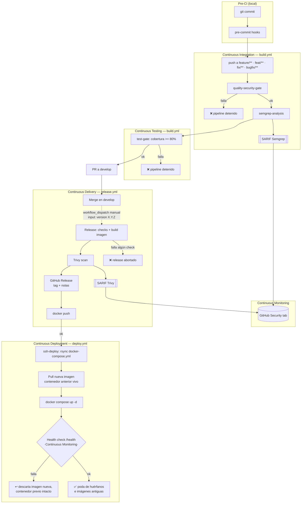
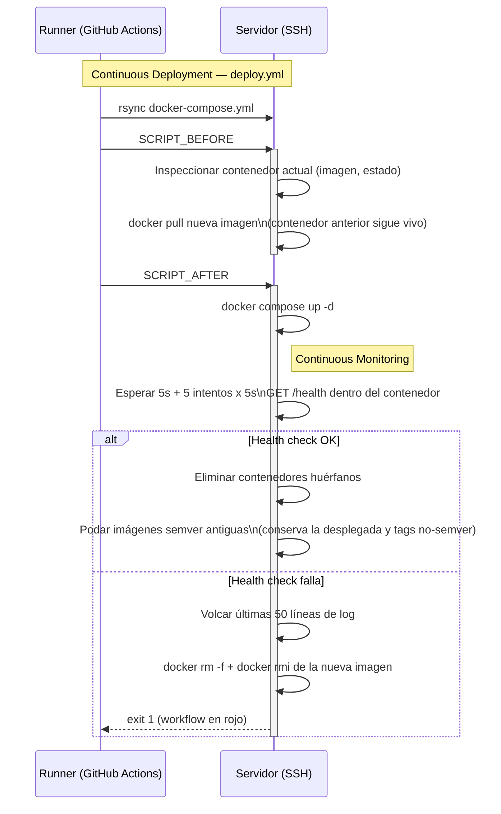
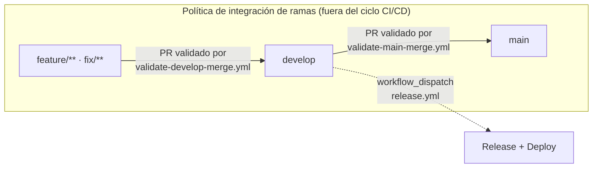

# Flujo CI/CD

Este documento describe el pipeline de integración, entrega y despliegue continuo de FitCoachIA:
qué dispara cada pieza, qué objetivo cumple dentro del ciclo y cómo fluye una ejecución de
principio a fin.

## 1. Alcance

Cubre los workflows de GitHub Actions y las composite actions que forman el pipeline, más el hook
de pre-commit que actúa como primera barrera antes de llegar a CI. **No** cubre los workflows
`validate-develop-merge.yml` y `validate-main-merge.yml`: no compilan, testean ni despliegan nada,
solo validan el origen de un PR, por lo que se documentan aparte en el [Anexo A](#anexo-a--políticas-de-integración-de-ramas).

| Pieza | Ruta | Tipo |
|---|---|---|
| Pre-commit | [`.pre-commit-config.yaml`](../.pre-commit-config.yaml) | Hook local |
| Test and build project | [`.github/workflows/build.yml`](../.github/workflows/build.yml) | Workflow |
| Generate and deploy release | [`.github/workflows/release.yml`](../.github/workflows/release.yml) | Workflow |
| Deploy release | [`.github/workflows/deploy.yml`](../.github/workflows/deploy.yml) | Workflow (reusable) |
| Python setup custom | [`.github/actions/python-setup/action.yml`](../.github/actions/python-setup/action.yml) | Composite action |
| Quality assurance | [`.github/actions/quality-check/action.yml`](../.github/actions/quality-check/action.yml) | Composite action |

La frontera entre **Delivery** y **Deployment** está en el `workflow_dispatch` de `release.yml`:
build, escaneo y publicación del artefacto son automáticos, pero **liberar una versión es una
decisión humana** (quién dispara el workflow y con qué versión). Una vez lanzada, el despliegue en
el servidor es 100 % automático y encadenado.

## 2. El pipeline por fases

Cada fase de la metodología DevOps se corresponde con una pieza concreta del repo. Por cada
herramienta se indica su **objetivo** dentro del ciclo, no el comando exacto que ejecuta.

### 2.1 Pre-CI (shift-left local) — `.pre-commit-config.yaml`

**Dispara**: `git commit`. Primera barrera, antes de que el código salga del equipo del
desarrollador; su objetivo es abaratar el coste de un error (detectarlo en segundos en local, no
en minutos en CI).

| Herramienta | Objetivo |
|---|---|
| Hooks básicos (whitespace, EOF, YAML, merge conflicts, ficheros grandes, `no-commit-to-branch`) | Higiene mínima del repo; bloquea de raíz el commit directo a `main`/`develop`. |
| `gitleaks` | Evita que un secreto llegue a existir en el historial de Git. |
| `ruff` + `ruff-format` | Estilo y errores estáticos detectables sin ejecutar el código; feedback inmediato. |
| `bandit` | Primera pasada de SAST sobre `src/`: patrones inseguros conocidos (`eval`, `subprocess`, etc.). |

### 2.2 Continuous Integration — `build.yml`

**Dispara**: `push` y `pull_request` sobre `feature/**`, `feat/**`, `fix/**`, `bugfix/**` (se
ignoran cambios que solo tocan documentación). Dos jobs encadenados por `needs`.

> ⚠️ El filtro de `pull_request` se evalúa sobre la rama **base**: un PR `feature/x → develop` no
> vuelve a disparar este workflow, porque esos commits ya se validaron en el `push` a la rama de
> trabajo. Ver [Anexo B](#anexo-b--notas-de-estado).

**Job `quality-security-gate`** — repite y endurece lo que el pre-commit ya comprobó en local
(ahora bloqueante para todo el equipo, no solo para quien hizo el commit), y añade auditoría de
dependencias:

| Herramienta | Objetivo |
|---|---|
| `pip-audit` (antes de instalar) | Corta el pipeline si una dependencia a instalar tiene una vulnerabilidad `HIGH`/`CRITICAL`, antes de traer código potencialmente vulnerable al runner. |
| `ruff` | Lint bloqueante para todo el equipo. |
| `mypy` | Seguridad de tipos estática; detecta errores que los tests no siempre cubren. |
| `gitleaks` | Segunda barrera anti-secretos, por si el hook local se saltó (`--no-verify`). |
| `pip-audit` (tras instalar) | Segunda pasada, ya sobre el entorno realmente instalado. |
| `bandit` | SAST bloqueante sobre `src/fitcoach/`. |

**Job `semgrep-analysis`** — SAST complementario a `bandit`, con reglas más amplias
(`p/python` + `p/owasp-top-ten`) y capacidad de detectar patrones entre archivos. Analiza solo el
diff en PRs, no el repo completo. **No bloquea el merge** (`continue-on-error: true`): su ratio de
falsos positivos es mayor que el de `bandit`, así que su valor está en la trazabilidad continua de
hallazgos — sube el resultado en formato SARIF a la pestaña **Security** de GitHub — no en cortar
el flujo de trabajo del equipo.

### 2.3 Continuous Testing — `build.yml` (job `test-gate`)

Valida comportamiento funcional real (unitarios + integración) contra el mismo stack que se usaría
en local (app + Postgres vía Docker), para que el resultado en CI nunca diverja del de desarrollo.
Gate: cobertura mínima del 80 % como proxy de calidad.

### 2.4 Continuous Delivery — `release.yml`

**Dispara**: `workflow_dispatch` manual con input `version` (`X.Y.Z`) — publicar una versión es una
decisión humana explícita. **Guardia**: solo se ejecuta si la rama es `develop` o `release/**`.

Objetivo general: convertir un commit en un artefacto versionado, escaneado y trazable, publicando
únicamente cuando lo anterior ya existe. El orden es deliberado — **se escanea la imagen antes de
publicarla, y solo se publica después de crear el tag/release**:

| Paso | Objetivo |
|---|---|
| Validar formato semver + que la versión no exista ya en el registro | Evita releases ambiguos o sobrescribir un tag ya publicado. |
| Build de la imagen sin publicarla (`push: false`) | Permite escanearla antes de que sea pública. |
| **Trivy** (escaneo de la imagen) | Equivalente a Semgrep pero sobre el artefacto construido (paquetes de SO + librerías del contenedor), no sobre el código fuente. Informativo, no bloquea el release; sube SARIF a la misma pestaña **Security** de GitHub que Semgrep, como un hallazgo distinto. |
| **GitHub Release** (tag + notas autogeneradas) | El artefacto final y trazable que queda publicado en GitHub (pestaña *Releases*, no *Security*): la versión pasa a existir oficialmente aquí, antes incluso de publicarse la imagen. |
| `docker push` | Último paso: la imagen solo llega al registro una vez que el release ya existe y fue escaneada. |

> Semgrep y Trivy son dos escáneres distintos en dos momentos distintos del ciclo — código fuente
> en CI, imagen construida en el release — pero ambos convergen en la misma pestaña Security de
> GitHub. El único fichero que se publica fuera de esa pestaña es la propia **GitHub Release**.

### 2.5 Continuous Deployment — `deploy.yml`

**Dispara**: automáticamente al terminar `Release`, o de forma independiente vía
`workflow_dispatch` para redesplegar una versión ya publicada. Los datos de conexión SSH viajan
como `secrets` (no `inputs`) para que GitHub los enmascare en los logs.

Patrón: **recreate verificado con rollback**. Se retira el contenedor en servicio conservando su
imagen (el artefacto de rollback), se levanta la nueva versión y se espera a que Docker la marque
`healthy` (`healthcheck` de `docker-compose.yml`, sondeado hasta 10 intentos); si no lo consigue, se
descartan contenedor e imagen nuevos y se restaura la versión anterior desde la imagen retenida. La
imagen previa solo se conserva hasta que la nueva demuestra estar sana. Esto implica una ventana
breve sin servicio en cada despliegue (~10-40 s, más si hay que revertir): el proxy devuelve 502 y
Telegram reintenta los updates, así que no se pierden mensajes.

**Prerrequisitos que CI nunca provee**, deben existir ya en el servidor: el fichero
`/etc/fitcoachia/prod/.env.prod` con permisos restringidos (no legible por el usuario de
despliegue), una regla `sudoers` NOPASSWD para ese usuario (ver [`docs/how-to.md`](how-to.md)) y la
red Docker externa `proxy-network`.

### 2.6 Continuous Monitoring

No hay un job dedicado; el monitoreo continuo se apoya en dos señales que ya generan las fases
anteriores:

- **Health check `/health`** tras cada despliegue — señal de salud inmediata del artefacto en producción.
- **Pestaña Security de GitHub** — acumula los SARIF de Semgrep (CI, código fuente) y Trivy
  (release, imagen construida) como registro continuo de hallazgos, independiente de si bloquearon
  o no el pipeline que los generó.

## 3. Diagramas

### 3.1 Flujo global

### 3.2 Secuencia de despliegue

## 4. Gates, secretos y artefactos

### Gates

| Gate | Dónde | Bloquea o informa |
|---|---|---|
| `pip-audit` (OSV, HIGH/CRITICAL) | `python-setup`, antes de instalar | Bloquea |
| `ruff` / `mypy` / `gitleaks` / `pip-audit` / `bandit` | `quality-check` | Bloquea |
| Semgrep (`p/python`, `p/owasp-top-ten`) | `build.yml` → `semgrep-analysis` | Informa (SARIF) |
| Cobertura de tests ≥ 80 % | `build.yml` → `test-gate` | Bloquea |
| Formato semver de la versión | `release.yml`, `deploy.yml` | Bloquea |
| Versión no debe existir ya en el registro | `release.yml` | Bloquea |
| Trivy (imagen, HIGH/CRITICAL) | `release.yml` | Informa (SARIF) |
| Origen de release: `develop` o `release/*` | `release.yml` (`if:`) | Bloquea |
| Health check `/health` tras el despliegue | `deploy.yml` | Bloquea (aborta el despliegue) |

### Artefactos publicados

| Artefacto | Generado por | Dónde se ve |
|---|---|---|
| SARIF Semgrep | `build.yml` → `semgrep-analysis` | Pestaña *Security* (code scanning) |
| SARIF Trivy | `release.yml` | Pestaña *Security* (code scanning) |
| GitHub Release (tag + notas) | `release.yml` | Pestaña *Releases* |
| Imagen Docker versionada | `release.yml` (`docker push`) | Registro Docker Hub |

### Secretos

| Secreto | Usado en |
|---|---|
| `DOCKER_USER`, `DOCKER_PASSWORD` | `release.yml` (login en Docker Hub) |
| `DOCKER_IMAGE_NAME` | `release.yml`, `deploy.yml` (nombre base de la imagen) |
| `SERVER_HOST`, `SERVER_USER`, `SERVER_PKEY` | `deploy.yml` (conexión SSH al servidor) |

Ningún workflow expone valores de estos secretos en logs; `deploy.yml` los declara como `secrets`
del `workflow_call` precisamente para garantizar el enmascarado.

---

## Anexo A — Políticas de integración de ramas

> Esta sección queda fuera del ciclo CI/CD descrito arriba: estos workflows no compilan, no
> testean ni despliegan nada. Su único propósito es validar **desde qué rama** se puede abrir un PR
> contra `develop` o `main`, como política de integración (equivalente a una regla de branch
> protection).

- **[`validate-develop-merge.yml`](../.github/workflows/validate-develop-merge.yml)** — en cada PR
  contra `develop`, comprueba que la rama de origen (`head_ref`) empiece por `feature/` o `fix/`;
  si no, falla el check y el PR queda bloqueado.
- **[`validate-main-merge.yml`](../.github/workflows/validate-main-merge.yml)** — en cada PR contra
  `main`, exige que la rama de origen sea exactamente `develop`.

Ambas se apoyan en el hook `no-commit-to-branch` de pre-commit (`main`, `develop`), que impide de
raíz el commit directo a esas ramas en local.

## Anexo B — Notas de estado

Observaciones sobre el estado actual del pipeline que conviene tener presentes al interpretar una
ejecución o al modificar los workflows:

| Observación | Detalle |
|---|---|
| PR a `develop` no re-ejecuta `build.yml` | El filtro `pull_request.branches` evalúa la rama **base**, no la de origen; la validación de esos commits ya ocurrió en el `push` a la rama de trabajo. |
| Prefijos de rama inconsistentes | `build.yml` acepta `feat/**` y `bugfix/**`, pero `validate-develop-merge.yml` solo admite `feature/**` y `fix/**` al fusionar contra `develop`. |
| Versión de Python sobrescrita | `env.PYTHON_VERSION: "3.12"` a nivel de workflow en `build.yml` queda pisado por `"3.11"` en los steps que usan `python-setup`. |
| Versión del proyecto desincronizada | `pyproject.toml` declara `0.1.0` mientras los tags Git ya están en `0.3.0`; no hay bump automático de versión. |
| `README.md` desactualizado | La sección `## CI/CD` describe workflows que ya no existen (`validate-merge-source.yml`) y afirma que `release.yml` se dispara con push a `main`, cuando en realidad es manual (`workflow_dispatch`) desde `develop`/`release/*`. |
