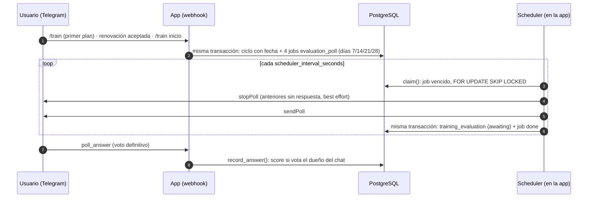
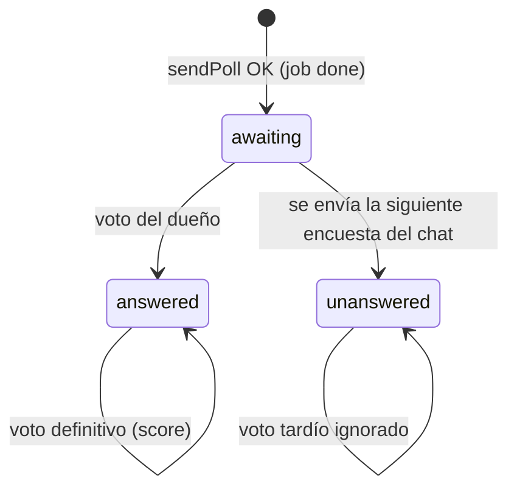

# Encuestas semanales de satisfacción

Cada mesociclo de 4 semanas pregunta al usuario, una vez por semana, qué le está pareciendo
su plan. La respuesta es una nota de 0 a 5 que queda en `training_evaluation` para medir la
satisfacción por semana, por objetivo y por plan.

Es un canal **independiente** de los avisos de cierre de mesociclo (propio tipo de job), pero ambos los ejecuta el mismo [scheduler](scheduler.md) y comparten la clasificación de
errores de Telegram. El comportamiento del agente entrenador está en [trainer-agent.md](trainer-agent.md);
el despliegue en [entornos-y-despliegue.md](entornos-y-despliegue.md).

---

## 1. Qué recibe el usuario

Un *poll* de Telegram **no anónimo**, de **una sola respuesta** y **sin posibilidad de cambiar el
voto** (`allows_revoting=False`): el primer voto es definitivo. Llega en el mismo hilo donde el
usuario habla con el bot:

> Semana {k} de tu plan para {objetivo}: ¿qué te está pareciendo?

| Opción | Nota |
|---|---|
| 0 - No me ha gustado nada | 0 |
| 1 - No me gusta mucho | 1 |
| 2 - Regular, mejorable | 2 |
| 3 - Está bien, puede mejorar | 3 |
| 4 - Me está gustando mucho | 4 |
| 5 - Lo recomiendo sin dudar | 5 |

El índice de la opción es la nota. `{objetivo}` es la etiqueta de `goal` en minúsculas
("ganar músculo", "perder grasa", "mejorar rendimiento"); si el plan no tiene un objetivo
conocido se usa *"Semana {k} de tu plan: ¿qué te está pareciendo?"*. Los textos viven en
`Constants.EVALUATION_POLL_*` ([constants.py](../src/fitcoach/domain/constants.py)).

El bot **no contesta** al voto: el poll ya muestra la selección.

---

## 2. Flujo de extremo a extremo

### 2.1 Programación (patrón outbox)

Las 4 encuestas se registran como jobs **en la misma transacción** que da fecha de inicio al ciclo,
con `schedule_cycle_jobs` ([postgres_job_repository.py](../src/fitcoach/infrastructure/database/postgres_job_repository.py)):

| Momento | Método | ¿Programa? |
|---|---|---|
| Primer plan | `PostgresConversationRepository.save_training_plan` | Sí, 4 semanas |
| Renovación aceptada (`kind == "renewal"`) | `PostgresTrainingRepository.accept` | Sí, 4 semanas del ciclo nuevo |
| Ciclo legacy que recibe fecha (`/train inicio`) | `PostgresTrainingRepository.set_start` | Sí, solo las semanas futuras |
| Cambio de ejercicios dentro del ciclo | `accept` con otro `kind` | No: mismo ciclo y misma fecha |
| `/train posponer` | `postpone` | No: solo se reprograma el aviso, nunca las encuestas |

Solo se programan las semanas cuyo vencimiento es **posterior a ahora** (`upcoming_polls` en
[training_evaluation.py](../src/fitcoach/domain/training_evaluation.py)): nunca se pregunta tarde
por una semana pasada. `dedup_key` (`evaluation_poll:{ciclo}:{semana}`, único) y
`ON CONFLICT DO NOTHING` hacen la programación idempotente.

Por qué outbox y no "recorrer los ciclos en cada tick": el scheduler solo lee los jobs vencidos por
el índice parcial `(execution_date) WHERE state IN ('pending', 'running')`, así que su coste depende
de los jobs pendientes, no del número de clientes.

### 2.2 Cancelación

| Evento | Efecto |
|---|---|
| Cierre del ciclo (`close_cycle`, también antes de renovar) | Los jobs `pending` del ciclo pasan a `cancelled` |
| `/interview` (`restart_interview`) | Los jobs `pending` del chat pasan a `cancelled`; las encuestas enviadas se conservan |
| Al ejecutar, el ciclo está cerrado o ya no es el vigente | El job se cancela (red de seguridad) |
| Al ejecutar, ya venció una semana más reciente | El job se cancela: solo se pregunta la última |

Solo se cancelan los `pending`, nunca un `running`: si se cancelara mientras se envía, el poll llegaría
a Telegram pero su `poll_id` no se guardaría y el voto se perdería.

### 2.3 Envío

El handler `_run_evaluation_poll` ([scheduler.py](../src/fitcoach/infrastructure/jobs/scheduler.py))
procesa hasta `evaluation_batch_size` jobs por tick:

1. `claim()` toma el job vencido más antiguo con `FOR UPDATE SKIP LOCKED`, lo marca `running`, lo
   bloquea `evaluation_sending_timeout_seconds` (`locked_until`) y suma un intento.
2. Si ya superó `evaluation_max_attempts` (el proceso murió a mitad de envío), se marca `failed` sin enviar.
3. Se comprueba que el ciclo sigue abierto, con plan vigente y que ninguna semana más reciente ha vencido; si
   no, el job se cancela. Se toma el `goal` y el `plan_id` **del plan vigente en ese momento**.
4. Las encuestas anteriores del chat que sigan en `awaiting` se cierran con `stopPoll` (*best effort*: si
   falla, se registra un aviso y se sigue).
5. `sendPoll` al chat e hilo del ciclo.
6. `save_sent()` inserta la fila de `training_evaluation` (`awaiting`, con `job_id`) y marca como
   `unanswered` las anteriores del chat; el scheduler confirma todo en **el mismo commit** que marca el job
   `done`. Si el lease se perdió entretanto, `finish` lanza `JobConflictError`, el *rollback* descarta la fila
   y el error queda en los logs.

Una encuesta sin respuesta **no se reenvía**: la semana siguiente llega la nueva y la anterior se cierra.

### 2.4 Respuesta

Telegram envía un update `poll_answer` (la app lo registra en `allowed_updates` al arrancar).
`ConversationService._record_poll_answer`
([conversation_service.py](../src/fitcoach/service/conversation_service.py)):

- Ignora el update si no hay repositorio de encuestas o si el votante es anónimo.
- Convierte la opción en nota con `score_from_option`; una opción fuera de 0-5 se ignora.
- `record_answer()` guarda `score`, `answered_at` y `answer_status = answered` **solo si el votante es el
  dueño del chat** (en chats privados `chat_id == user_id`). Un `poll_id` desconocido se ignora sin error.
- Un voto sobre una encuesta `unanswered` (ya cerrada por la siguiente) se **ignora** y se registra en el log.
- El usuario no puede cambiar ni retirar su voto: la encuesta se envía con `allows_revoting=False`.
  Si aun así llegara un voto vacío (voto retirado) sobre una encuesta no cerrada, se guardaría `score = NULL`
  y volvería a `awaiting`; es solo una defensa.
- Como el resto de updates, pasa por `claim_update`: una reentrega de Telegram no se procesa dos veces.

---

## 3. Estados

El envío es un job ([scheduler.md](scheduler.md#ciclo-de-vida-de-un-job)): `pending → running → done | failed |
cancelled` (o de vuelta a `pending` si se reintenta). Una vez enviada, la encuesta solo guarda su resultado en
`training_evaluation.answer_status`:

| `answer_status` | Significado |
|---|---|
| `awaiting` | Enviada, sin respuesta; su poll sigue abierto |
| `answered` | El dueño votó; `score` rellenado |
| `unanswered` | Cerrada al enviar la siguiente sin haber recibido voto |

---

## 4. Reglas de negocio

| Regla | Dónde se aplica |
|---|---|
| 4 encuestas por mesociclo, a los 7, 14, 21 y 28 días de `started_at` | `upcoming_polls`, `execution_date` |
| Se envían **siempre**, aunque el usuario tenga `/train avisos off` | El handler no mira `reminders_enabled` |
| Sin fecha de inicio o con el ciclo cerrado no se envían | `schedule_cycle_jobs`, handler |
| Aplazar no genera ni mueve encuestas | `postpone` solo reprograma el aviso |
| Tras una caída solo se envía la semana más reciente | handler → `is_superseded` con `due_week` |
| Sin respuesta no se reenvía; se cierra al enviar la siguiente (también entre ciclos) | `save_sent`, `stopPoll` |
| Solo cuenta el voto del dueño del chat | `record_answer` |
| Sobrevive a `/interview` con la nota y el objetivo | FK `ON DELETE SET NULL` + copia de `goal` |

---

## 5. Modelo de datos

Tabla `training_evaluation` (migración `c2d8e4f6a1b3`; diagrama completo en
[modelo-datos.md](modelo-datos.md)). Contiene solo encuestas **enviadas**; los intentos fallidos o
cancelados quedan en `job_execution`.

| Columna | Uso |
|---|---|
| `chat_id` | Dueño; índice `(chat_id, sent_at)` |
| `mesocycle_id`, `plan_id` | FK `ON DELETE SET NULL` |
| `job_id` | FK `ON DELETE SET NULL` al job que la produjo |
| `goal` | Copia de `training_plans.goal` al enviar; conserva el objetivo tras `/interview` |
| `week_number` | 1-4 (`CHECK`); `UNIQUE (mesocycle_id, week_number)` |
| `answer_status` | `awaiting`, `answered` o `unanswered` (`CHECK`) |
| `telegram_poll_id` (único), `telegram_message_id` | Para asociar el voto y cerrar el poll |
| `score` (0-5, `CHECK`), `sent_at`, `answered_at` | Resultado |

`training_plans.goal` es una copia de `plan["goal"]` para no parsear el JSON; los planes anteriores la reciben
con el *backfill* `d9a1b3c5e7f2`.

---

## 6. Propiedades configurables y reintentos

Encuestas y avisos de mesociclo comparten la misma política de reintentos,
`RetryPolicy` ([retry_policy.py](../src/fitcoach/domain/retry_policy.py)), que se construye desde
la configuración de cada tipo (`_RetrySettings.to_retry_policy()` en
[settings.py](../src/fitcoach/infrastructure/config/settings.py)). El intervalo entre ticks es común
(`scheduler_interval_seconds`); el resto se configura por tipo:

| Propiedad | Encuestas | Avisos de mesociclo | Defecto | Validación |
|---|---|---|---|---|
| Activación del scheduler | `scheduler_enabled` | `scheduler_enabled` | `false` | — |
| Intervalo entre ticks | `scheduler_interval_seconds` | `scheduler_interval_seconds` | `300` | ≥ 10 |
| Intentos máximos | `evaluation_max_attempts` | `training_reminder_max_attempts` | `5` | 1-10 |
| Espera inicial (se duplica) | `evaluation_retry_delay_seconds` | `training_reminder_retry_delay_seconds` | `30` | ≥ 1 |
| Tope de la espera | `evaluation_retry_max_delay_seconds` | `training_reminder_retry_max_delay_seconds` | `3600` | ≥ espera inicial |
| Bloqueo mientras se envía | `evaluation_sending_timeout_seconds` | `training_reminder_sending_timeout_seconds` | `120` | ≥ 10 |
| Tamaño de lote | `evaluation_batch_size` | `training_reminder_batch_size` | `100` | 1-1000 |

Un valor fuera de rango o un tope menor que la espera inicial **aborta el arranque** de la app (fail fast).
Las plantillas están en `.env.example`. Las variables `*_interval_seconds` por tipo ya no se leen.

**Espera entre reintentos**: `min(tope, espera_inicial × 2^intentos)`. Con los valores por defecto:
60 s, 120 s, 240 s, 480 s… hasta 3600 s.

**Clasificación de errores de Telegram** (`classify_failure` en
[telegram_delivery.py](../src/fitcoach/infrastructure/jobs/telegram_delivery.py)), común a los dos tipos:

| Error | Resultado |
|---|---|
| `RetryAfter` | Reintento cuando indica Telegram (mínimo 1 s); `failed` si se agotaron los intentos |
| `BadRequest`, `Forbidden` (chat inexistente, bot bloqueado) | `failed`, sin reintento |
| `NetworkError`, `TimedOut` | Reintento con la espera de la política; `failed` si se agotaron |
| Cualquier otro `TelegramError` | `failed` con log ERROR; el scheduler sigue con el resto |

Un error de base de datos en un tick se registra y el bucle sigue en el siguiente.

---

## 7. Componentes

| Capa | Fichero | Responsabilidad |
|---|---|---|
| Dominio | `domain/training_evaluation.py` | Calendario (`upcoming_polls`, `due_week`, `is_superseded`), escala y `AnswerStatus` |
| Dominio | `domain/scheduled_job.py`, `domain/retry_policy.py` | Jobs, resultados y política de reintentos |
| Puerto | `repository/evaluation_repository.py`, `repository/job_repository.py` | `EvaluationRepository`, `JobRepository` |
| Adaptador | `infrastructure/database/postgres_evaluation_repository.py` | `open_current_plan`, `previous_unanswered`, `save_sent`, `record_answer` |
| Adaptador | `infrastructure/database/postgres_job_repository.py` | Registro, cancelación, reclamo y cierre de jobs |
| Scheduler | `infrastructure/jobs/scheduler.py` | Bucle, handler de encuesta, texto de la pregunta y cierre de los polls anteriores |
| Scheduler (común) | `infrastructure/jobs/telegram_delivery.py` | Clasificación de errores |
| Servicio | `service/conversation_service.py` | Recepción de `poll_answer` |
| Arranque | `main.py` | Tarea del scheduler y `poll_answer` en `allowed_updates` |

---

## 8. Despliegue

Ya no hay contenedor aparte: el scheduler corre dentro de la app. Para activar las encuestas, en el `.env` del
entorno: `scheduler_enabled=true`, que activa todos los tipos de job. Detalle en [scheduler.md](scheduler.md).

---

## 9. Limitaciones conocidas

- **Entrega al menos una vez.** Si el proceso cae entre `sendPoll` y el commit, al caducar el
  bloqueo la encuesta se reenvía (como mucho hasta `max_attempts`).
- **Chats privados.** "Dueño del chat" asume `chat_id == user_id`; en grupos no se registraría el voto.
- **Votos sobre encuestas cerradas.** Telegram no deja votar un poll cerrado; si aun así llega el voto de una
  encuesta `unanswered`, se ignora.
- **Cierre best effort.** Si `stopPoll` falla, la encuesta queda `unanswered` en la base aunque el poll siga
  abierto en Telegram.
- **Grafana**: el dashboard *Negocio y activación* muestra satisfacción media por cliente, % sin
  contestar y % no generadas (cada uno con su nº absoluto y su total) y el detalle por `chat_id` (N4 en
  [metricas-negogio-y-tecnicas.md](plan/metricas-negogio-y-tecnicas.md)). La media semanal y la
  distribución 0-5 siguen en el backlog ([evaluation-estado.md](todo/evaluation-estado.md)).
- Plan de pruebas y casos manuales: [evaluation-tests.md](todo/evaluation-tests.md) (histórico: describe los workers
  anteriores al scheduler).
