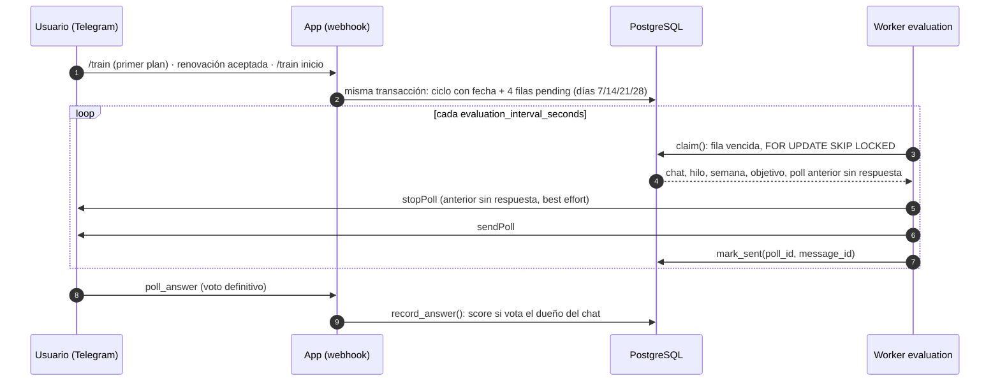
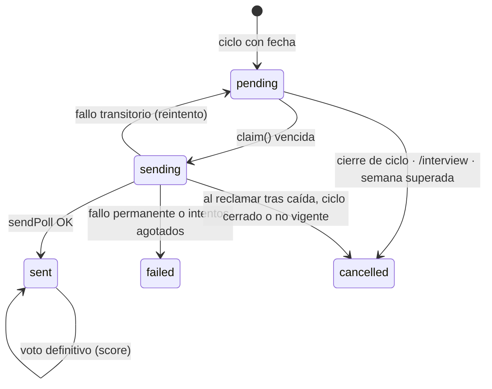

# Encuestas semanales de satisfacción

Cada mesociclo de 4 semanas pregunta al usuario, una vez por semana, qué le está pareciendo
su plan. La respuesta es una nota de 0 a 5 que queda en `training_evaluation` para medir la
satisfacción por semana, por objetivo y por plan.

Es un canal **independiente** de los avisos de cierre de mesociclo: tiene su propia tabla, su
propio worker (`evaluation`) y su propio flag. Ambos comparten el bucle periódico y la política
de reintentos (sección 6). El comportamiento del agente entrenador está en
[trainer-agent.md](trainer-agent.md); el despliegue de los workers en
[entornos-y-despliegue.md](entornos-y-despliegue.md).

---

## 1. Qué recibe el usuario

Un *poll* de Telegram **no anónimo**, de **una sola respuesta** y **sin posibilidad de cambiar el
voto** (`allows_revoting=False`): el primer voto es definitivo. Llega en el mismo hilo donde el
usuario habla con el bot:

> Semana {k} de tu plan para {objetivo}: ¿qué te está pareciendo?

| Opción | Nota |
|---|---|
| 0 - No me ha gustado nada | 0 |
| 1 - No me gusta mucho | 1 |
| 2 - Regular, mejorable | 2 |
| 3 - Está bien, puede mejorar | 3 |
| 4 - Me está gustando mucho | 4 |
| 5 - Lo recomiendo sin dudar | 5 |

El índice de la opción es la nota. `{objetivo}` es la etiqueta de `goal` en minúsculas
("ganar músculo", "perder grasa", "mejorar rendimiento"); si el plan no tiene un objetivo
conocido se usa *"Semana {k} de tu plan: ¿qué te está pareciendo?"*. Los textos viven en
`Constants.EVALUATION_POLL_*` ([constants.py](../src/fitcoach/domain/constants.py)).

El bot **no contesta** al voto: el poll ya muestra la selección.

---

## 2. Flujo de extremo a extremo

### 2.1 Programación (patrón outbox)

Las 4 encuestas se insertan **en la misma transacción** que da fecha de inicio al ciclo, con
`schedule_evaluations` ([postgres_evaluation_repository.py](../src/fitcoach/infrastructure/database/postgres_evaluation_repository.py)):

| Momento | Método | ¿Programa? |
|---|---|---|
| Primer plan | `PostgresConversationRepository.save_training_plan` | Sí, 4 semanas |
| Renovación aceptada (`kind == "renewal"`) | `PostgresTrainingRepository.accept` | Sí, 4 semanas del ciclo nuevo |
| Ciclo legacy que recibe fecha (`/train inicio`) | `PostgresTrainingRepository.set_start` | Sí, solo las semanas futuras |
| Cambio de ejercicios dentro del ciclo | `accept` con otro `kind` | No: mismo ciclo y misma fecha |
| `/train posponer` | `postpone` | No: solo mueve el fin previsto |

Solo se programan las semanas cuyo vencimiento es **posterior a ahora** (`upcoming_polls` en
[training_evaluation.py](../src/fitcoach/domain/training_evaluation.py)): nunca se pregunta tarde
por una semana pasada. `UNIQUE (mesocycle_id, week_number)` y `ON CONFLICT DO NOTHING` hacen la
programación idempotente.

Por qué outbox y no "recorrer los ciclos en cada tick": el worker solo lee las filas vencidas por
el índice parcial `(due_at) WHERE state IN ('pending', 'sending')`, así que su coste depende de
las encuestas pendientes, no del número de clientes. Cada cliente añade 4 filas cada 4 semanas.

### 2.2 Cancelación

| Evento | Efecto |
|---|---|
| Cierre del ciclo (`close_cycle`, también antes de renovar) | Las `pending` del ciclo pasan a `cancelled` |
| `/interview` (`restart_interview`) | Las `pending` del chat pasan a `cancelled`; las filas se conservan |
| Al reclamar, el ciclo está cerrado o ya no es el vigente | La fila se cancela (red de seguridad) |
| Al reclamar, ya venció una semana más reciente | La fila se cancela: solo se pregunta la última |

Solo se cancelan las `pending`, nunca una `sending`: si se cancelara mientras un worker la está
enviando, el poll llegaría a Telegram pero su `poll_id` no se guardaría y el voto se perdería.

### 2.3 Envío

El worker ([jobs/evaluation.py](../src/fitcoach/infrastructure/jobs/evaluation.py)) procesa un
lote de hasta `evaluation_batch_size` filas por tick:

1. `claim()` toma la fila vencida más antigua con `FOR UPDATE SKIP LOCKED` (dos workers nunca
   toman la misma), la marca `sending`, bloquea la fila `evaluation_sending_timeout_seconds`
   (`locked_until`) y suma un intento. Copia en la fila el `goal` y el `plan_id` **del plan
   vigente en ese momento**.
2. Si la fila ya superó `evaluation_max_attempts` (un worker murió a mitad de envío), se marca
   `failed` sin enviar.
3. Si la encuesta anterior del ciclo se envió y sigue sin respuesta, se cierra con `stopPoll`.
   Es *best effort*: si falla (ya cerrada, mensaje borrado) se registra un aviso y se sigue.
4. `sendPoll` al chat e hilo del ciclo.
5. `mark_sent()` guarda `telegram_poll_id`, `telegram_message_id` y `sent_at`. Si el bloqueo
   caducó entretanto, lanza `EvaluationConflictError` y el error queda visible en los logs.

Una encuesta sin respuesta **no se reenvía**: la semana siguiente llega la nueva y la anterior
se cierra.

### 2.4 Respuesta

Telegram envía un update `poll_answer` (la app lo registra en `allowed_updates` al arrancar).
`ConversationService._record_poll_answer`
([conversation_service.py](../src/fitcoach/service/conversation_service.py)):

- Ignora el update si no hay repositorio de encuestas o si el votante es anónimo.
- Convierte la opción en nota con `score_from_option`; una opción fuera de 0-5 se ignora.
- `record_answer()` guarda `score` y `answered_at` **solo si el votante es el dueño del chat**
  (en chats privados `chat_id == user_id`). Un `poll_id` desconocido se ignora sin error.
- El usuario no puede cambiar ni retirar su voto: la encuesta se envía con `allows_revoting=False`.
  Si aun así llegara un voto vacío (voto retirado), se guardaría `score = NULL`; es solo una defensa.
- Como el resto de updates, pasa por `claim_update`: una reentrega de Telegram no se procesa dos veces.

---

## 3. Estados de una encuesta

| Estado | Significado |
|---|---|
| `pending` | Programada, o devuelta a la cola para reintentar |
| `sending` | Reclamada por un worker; bloqueada hasta `locked_until` |
| `sent` | Entregada; `score` se rellena al votar |
| `failed` | No se pudo entregar y no se reintentará |
| `cancelled` | Ya no tiene sentido enviarla |

---

## 4. Reglas de negocio

| Regla | Dónde se aplica |
|---|---|
| 4 encuestas por mesociclo, a los 7, 14, 21 y 28 días de `started_at` | `upcoming_polls`, `due_at` |
| Se envían **siempre**, aunque el usuario tenga `/train avisos off` | El worker no mira `reminders_enabled` |
| Sin fecha de inicio o con el ciclo cerrado no se envían | `schedule_evaluations`, `claim` |
| Aplazar no genera encuestas extra | `postpone` no programa |
| Tras una caída del worker solo se envía la semana más reciente | `claim` → `_superseded` con `due_week` |
| Sin respuesta no se reenvía; se cierra al enviar la siguiente | `_previous_unanswered`, `stopPoll` |
| Solo cuenta el voto del dueño del chat | `record_answer` |
| Sobrevive a `/interview` con la nota y el objetivo | FK `ON DELETE SET NULL` + copia de `goal` |

---

## 5. Modelo de datos

Tabla `training_evaluation` (migración `c2d8e4f6a1b3`; diagrama completo en
[modelo-datos.md](modelo-datos.md)):

| Columna | Uso |
|---|---|
| `chat_id` | Dueño; índice `(chat_id, sent_at)` |
| `mesocycle_id`, `plan_id` | FK `ON DELETE SET NULL`; `plan_id` se rellena al enviar |
| `goal` | Copia de `training_plans.goal` al enviar; conserva el objetivo tras `/interview` |
| `week_number` | 1-4 (`CHECK`); `UNIQUE (mesocycle_id, week_number)` |
| `due_at` | Vencimiento; se mueve hacia delante en cada reintento |
| `state`, `locked_until`, `attempts` | Cola de envío |
| `telegram_poll_id` (único), `telegram_message_id` | Para asociar el voto y cerrar el poll |
| `score` (0-5, `CHECK`), `sent_at`, `answered_at` | Resultado |

`training_plans.goal` es una copia de `plan["goal"]` para no parsear el JSON; los planes
anteriores la reciben con el *backfill* `d9a1b3c5e7f2`. Al desplegar, `e5c7a9b1d3f4` programa
las semanas **futuras** de los ciclos ya abiertos, para que nadie reciba de golpe encuestas de
semanas pasadas.

---

## 6. Propiedades configurables y reintentos

Encuestas y avisos de mesociclo comparten la misma política de reintentos,
`RetryPolicy` ([retry_policy.py](../src/fitcoach/domain/retry_policy.py)), que se construye desde
la configuración (`_RetrySettings.to_retry_policy()` en
[settings.py](../src/fitcoach/infrastructure/config/settings.py)). Cada worker tiene su prefijo:

| Propiedad | Encuestas | Avisos de mesociclo | Defecto | Validación |
|---|---|---|---|---|
| Activación | `evaluation_enabled` | `training_reminders_enabled` | `false` | — |
| Intervalo entre lotes | `evaluation_interval_seconds` | `training_reminder_interval_seconds` | `300` | ≥ 10 |
| Intentos máximos | `evaluation_max_attempts` | `training_reminder_max_attempts` | `5` | 1-10 |
| Espera inicial (se duplica) | `evaluation_retry_delay_seconds` | `training_reminder_retry_delay_seconds` | `30` | ≥ 1 |
| Tope de la espera | `evaluation_retry_max_delay_seconds` | `training_reminder_retry_max_delay_seconds` | `3600` | ≥ espera inicial |
| Bloqueo mientras se envía | `evaluation_sending_timeout_seconds` | `training_reminder_sending_timeout_seconds` | `120` | ≥ 10 |
| Tamaño de lote | `evaluation_batch_size` | `training_reminder_batch_size` | `100` | 1-1000 |

Un valor fuera de rango o un tope menor que la espera inicial **aborta el arranque** del worker
(fail fast). Las plantillas están en `.env.example`.

**Espera entre reintentos**: `min(tope, espera_inicial × 2^intentos)`. Con los valores por defecto:
60 s, 120 s, 240 s, 480 s… hasta 3600 s.

**Clasificación de errores de Telegram** (`classify_failure` en
[telegram_delivery.py](../src/fitcoach/infrastructure/jobs/telegram_delivery.py)), común a los
dos workers:

| Error | Resultado |
|---|---|
| `RetryAfter` | Reintento cuando indica Telegram (mínimo 1 s); `failed` si se agotaron los intentos |
| `BadRequest`, `Forbidden` (chat inexistente, bot bloqueado) | `failed`, sin reintento |
| `NetworkError`, `TimedOut` | Reintento con la espera de la política; `failed` si se agotaron |
| Cualquier otro `TelegramError` | `failed` y el worker se detiene para que el error se vea |

Un error de base de datos en un tick se registra y el bucle sigue en el siguiente
(`run_periodically` en [worker_loop.py](../src/fitcoach/infrastructure/jobs/worker_loop.py));
con `--once` se propaga.

---

## 7. Componentes

| Capa | Fichero | Responsabilidad |
|---|---|---|
| Dominio | `domain/training_evaluation.py` | Calendario (`upcoming_polls`, `due_week`, `due_at`), escala y estados |
| Dominio | `domain/retry_policy.py` | Espera y agotamiento de reintentos |
| Puerto | `repository/evaluation_repository.py` | `EvaluationRepository`, `EvaluationDelivery` |
| Adaptador | `infrastructure/database/postgres_evaluation_repository.py` | `schedule_evaluations`, `cancel_pending_evaluations`, `claim`, `mark_sent`, `finish`, `record_answer` |
| Worker | `infrastructure/jobs/evaluation.py` | Lote de envío, texto de la pregunta, cierre del poll anterior |
| Worker (común) | `infrastructure/jobs/worker_loop.py`, `telegram_delivery.py` | Bucle periódico y clasificación de errores |
| Servicio | `service/conversation_service.py` | Recepción de `poll_answer` |
| Arranque | `main.py` | `poll_answer` en `allowed_updates` |

---

## 8. Despliegue

| Entorno | Servicio |
|---|---|
| Desarrollo | `evaluation-dev` en `docker-compose.dev.yml` |
| Local | `evaluation` en `docker-compose.local.yml` |
| Producción | `evaluation-prod` en `docker-compose.yml` |
| Tests | `evaluation` (perfil `evaluation`, intervalo 10 s); `make tests` no lo levanta, el flujo se prueba ejecutando el worker en proceso |

Reutilizan la imagen de la app con entrypoint `python -m fitcoach.infrastructure.jobs.evaluation`
y esperan a que la app esté sana (ya ha migrado). Lote acotado:
`docker compose run --rm evaluation-prod --once`.

Para activarlas, `evaluation_enabled=true` en el `.env` del entorno.

---

## 9. Limitaciones conocidas

- **Entrega al menos una vez.** Si el worker cae entre `sendPoll` y `mark_sent`, al caducar el
  bloqueo la encuesta se reenvía (como mucho hasta `max_attempts`).
- **Chats privados.** "Dueño del chat" asume `chat_id == user_id`; en grupos no se registraría el voto.
- **Votos sobre encuestas cerradas.** Telegram no deja votar un poll cerrado, así que una encuesta
  cerrada sin respuesta queda con `score = NULL`.
- **Sin panel de Grafana todavía**: media semanal, distribución 0-5 y tasa de respuesta están en
  el backlog ([evaluation-estado.md](todo/evaluation-estado.md)).
- Plan de pruebas y casos manuales: [evaluation-tests.md](todo/evaluation-tests.md).
