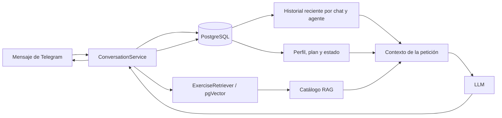

# Memoria de los agentes

Los agentes de FitCoachIA no conservan la conversación dentro del objeto Python ni dependen de
una sesión en memoria del proceso. Cada petición reconstruye el contexto necesario leyendo el
estado persistido en PostgreSQL para el `chat_id` de Telegram.

Esto permite reiniciar o replicar la aplicación sin perder conversaciones, perfiles o planes. Las
cadenas del LLM pueden estar cacheadas y compartirse entre peticiones porque no almacenan estado
mutable de un usuario.

## Tipos de memoria

| Tipo | Persistencia | Uso |
|---|---|---|
| Historial conversacional | `conversation_messages` | Turnos recientes enviados de nuevo al LLM. |
| Perfil del usuario | `interviewer_profiles` | Resultado estructurado y validado de la entrevista. |
| Estado de entrevista | `interview_sessions` | Indica si la entrevista está en curso o terminada. |
| Plan vigente e histórico | `training_sessions` y `training_plans` | Plan actual y versiones confirmadas anteriores. |
| Continuidad del entrenamiento | Mesociclos, workflows y sesiones registradas | Renovaciones, sustituciones, revisiones y progreso declarado. |
| Contexto RAG | pgVector, recuperado por petición | Ejercicios permitidos para generar o renovar un plan. |

El historial es memoria textual acotada. El perfil, el plan y la continuidad son memoria
estructurada y autoritativa: el agente no necesita inferir esos datos de conversaciones antiguas.
El catálogo RAG no es historial del usuario; es conocimiento externo recuperado específicamente
para una generación.

## Historial conversacional

Cada turno persistido crea dos filas en `conversation_messages`: una con rol `user` y otra con rol
`assistant`. Las filas incluyen:

- `chat_id`, que identifica la conversación de Telegram.
- `agent`, que separa los historiales del entrevistador y del entrenador.
- `role`, con valor `user` o `assistant`.
- `content` y `created_at`.

Al preparar una llamada, el repositorio selecciona primero los mensajes más recientes, aplica el
límite configurado y los devuelve en orden cronológico. Solo esa ventana se incluye en el prompt;
el resto continúa almacenado, pero no consume contexto del modelo.

Los límites predeterminados son:

| Agente | Variable | Valor predeterminado |
|---|---|---:|
| Entrevistador | `ia_history_window_messages` | 20 mensajes |
| Entrenador | `ia_trainer_history_window_messages` | 10 mensajes |

El límite cuenta mensajes individuales, no turnos completos. Como normalmente cada turno produce
un mensaje del usuario y otro del asistente, una ventana de 20 mensajes representa
aproximadamente 10 intercambios.

### Separación por agente

La consulta del historial utiliza `chat_id + agent`. Por tanto:

- `interviewer` recibe únicamente su conversación de entrevista.
- `trainer` recibe únicamente sus consultas y respuestas sobre el entrenamiento.
- El entrenador no hereda automáticamente toda la transcripción de la entrevista.

La información relevante de la entrevista se transfiere al entrenador mediante el perfil
estructurado, no mezclando ambos historiales.

## Memoria del entrevistador

En cada mensaje de una entrevista activa se construye este contexto:

```text
system prompt del entrevistador
+ historial reciente del agente interviewer
+ mensaje actual del usuario
```

Cuando la entrevista continúa, se guarda el nuevo turno en `conversation_messages`. Cuando
finaliza, la misma operación persiste de forma atómica:

1. El último turno de conversación.
2. El `InterviewerProfile` serializado como JSON.
3. El informe legible de la entrevista.
4. El estado `completed` de `interview_sessions`.

Al leer un perfil guardado se valida de nuevo contra el modelo de dominio actual. Si un cambio de
esquema hace que deje de ser válido, se registra el problema y se trata como perfil ausente; no se
genera un plan utilizando datos incompatibles.

## Memoria del entrenador

El entrenador usa distintos contextos según la operación.

### Generación inicial

La generación de un plan no necesita el historial conversacional. Recibe:

```text
system prompt + skill del entrenador
+ ejercicios recuperados por RAG
+ perfil estructurado del usuario
```

El catálogo recuperado sustituye `{{rag_context}}` en el prompt. El modelo solo puede emplear los
identificadores de ejercicios recuperados y la aplicación valida que no invente otros.

Si el resultado es válido, el plan se guarda como una versión inmutable en `training_plans` y
`training_sessions.current_plan_id` pasa a señalarlo. También se conserva una traza con el modelo,
la skill, hashes del prompt y los IDs recuperados.

### Preguntas sobre el plan

Para una consulta posterior se construye:

```text
answer prompt del entrenador
+ historial reciente del agente trainer
+ plan vigente completo
+ perfil efectivo del usuario
+ pregunta actual
```

El plan almacenado y el perfil son la fuente de verdad. El historial aporta continuidad
conversacional, pero no puede modificar el plan por sí solo. Una consulta normal es de solo lectura;
las renovaciones y sustituciones utilizan workflows explícitos y requieren confirmación.

### Renovaciones y progreso

Las renovaciones utilizan un contexto estructurado de adaptación. Puede incluir el perfil efectivo,
el plan anterior, el mesociclo, la revisión declarada y un resumen acotado de sesiones registradas.
Además se recupera de nuevo el catálogo RAG compatible con las restricciones actuales.

Los borradores y estados intermedios se guardan en la base de datos, por lo que un workflow puede
reanudarse tras otra petición o un reinicio del servicio.

## RAG frente a memoria

El RAG del entrenador no funciona como una memoria autobiográfica del agente. En una generación o
renovación:

1. Se construyen consultas a partir del perfil y del grupo muscular.
2. El servicio de embeddings y pgVector recuperan ejercicios compatibles.
3. Los resultados se limpian, limitan y convierten en datos dentro del prompt.
4. El agente genera el plan usando únicamente ese catálogo.

Las preguntas ordinarias sobre un plan ya guardado no consultan pgVector: reciben directamente el
plan vigente, el perfil y el historial reciente.

## Reinicio y borrado

Iniciar una entrevista nueva sustituye la identidad deportiva conocida del chat. El método
`restart_interview()` elimina para ese `chat_id`:

- Todo el historial conversacional de todos los agentes.
- La sesión y el perfil de entrevista.
- La sesión de entrenamiento.
- Los planes y mesociclos derivados del perfil anterior.

Después crea una nueva sesión de entrevista con estado `in_progress`. El plan se elimina
deliberadamente porque conservarlo permitiría mostrar un entrenamiento calculado para un perfil que
ya ha sido reemplazado.

## Aislamiento y limitaciones

El aislamiento actual se realiza por `chat_id`, no por `telegram_user_id` ni por
`message_thread_id`. El diseño asume chats privados 1:1, donde el chat identifica también al
usuario.

Si en el futuro se admiten grupos o foros, dos personas o dos hilos dentro del mismo `chat_id`
podrían compartir historial, perfil y plan. Para soportarlos correctamente habría que revisar de
forma conjunta las claves de conversación, perfiles, entrenamiento, uso de tokens y workflows.

Tampoco existe memoria semántica de conversaciones antiguas: los mensajes fuera de la ventana no
se resumen ni se recuperan por embeddings. La continuidad de largo plazo depende de los datos
estructurados persistidos, como el perfil, los planes, los mesociclos y las sesiones registradas.

## Flujo resumido



## Código relacionado

- `src/fitcoach/service/conversation_service.py`: selecciona el flujo y recupera la memoria.
- `src/fitcoach/service/agent/interviewer_chain.py`: construye los mensajes del entrevistador.
- `src/fitcoach/service/agent/trainer_chain.py`: construye los contextos de generación y consulta.
- `src/fitcoach/service/agent/rag_context.py`: transforma ejercicios recuperados en contexto.
- `src/fitcoach/repository/conversation_repository.py`: contrato de persistencia.
- `src/fitcoach/infrastructure/database/postgres_conversation_repository.py`: implementación en
  PostgreSQL.
- `src/fitcoach/infrastructure/database/models.py`: tablas que almacenan historial y estado.
- [`interviewer-agent.md`](interviewer-agent.md): comportamiento del entrevistador.
- [`trainer-agent.md`](trainer-agent.md): generación, consultas y continuidad del entrenador.
- [`modelo-datos.md`](modelo-datos.md): esquema completo de PostgreSQL.
