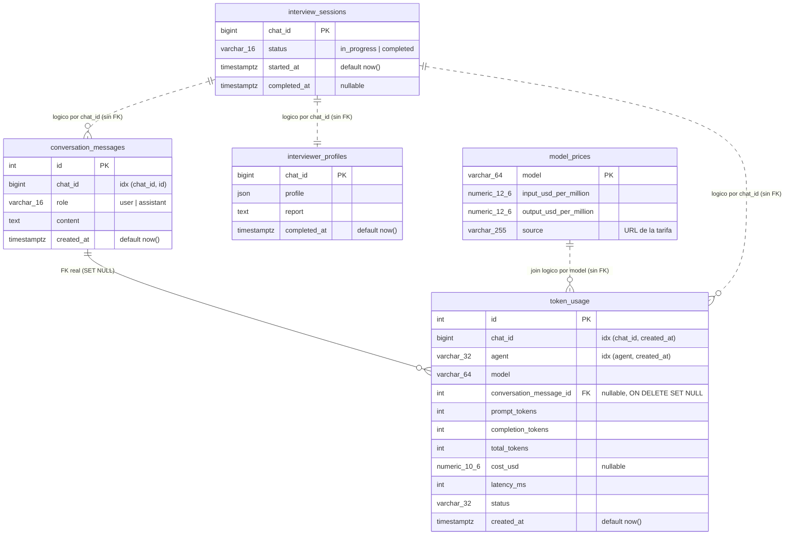

# Modelo de datos de FitCoachIA

Esquema de PostgreSQL tal y como lo generan las migraciones de Alembic. La
fuente de verdad son [`alembic/versions/`](../alembic/versions/) y
[`src/fitcoach/infrastructure/database/models.py`](../src/fitcoach/infrastructure/database/models.py);
este documento es la vista de conjunto.

## 1. Diagrama

Línea continua = *foreign key* real en la base de datos.
Línea discontinua = relación lógica que solo existe en el código.

## 2. Tablas

| Tabla | PK | Cardinalidad | Migración que la crea |
|---|---|---|---|
| `conversation_messages` | `id` (serial) | N por chat (histórico) | [`c5ae33575d94`](../alembic/versions/c5ae33575d94_create_conversation_messages.py) |
| `interview_sessions` | `chat_id` | 1 por chat | [`6ca1174fc623`](../alembic/versions/6ca1174fc623_add_interview_profiles.py) |
| `interviewer_profiles` | `chat_id` | 1 por chat | [`6ca1174fc623`](../alembic/versions/6ca1174fc623_add_interview_profiles.py) |
| `token_usage` | `id` (serial) | N por chat, 1 por llamada al LLM | [`7287a3dffce8`](../alembic/versions/7287a3dffce8_create_token_usage.py) |
| `model_prices` | `model` | 1 por modelo (catálogo) | [`ab12cd34ef56`](../alembic/versions/ab12cd34ef56_create_model_prices.py) |
| `alembic_version` | `version_num` | 1 fila | la crea Alembic, no la modela la app |

Cadena de migraciones:
`c5ae33575d94` → `6ca1174fc623` → `7287a3dffce8` → `9d4e6b7a1c2f` → `ab12cd34ef56`.
La revisión intermedia [`9d4e6b7a1c2f`](../alembic/versions/9d4e6b7a1c2f_set_null_token_usage_message_fk.py)
no crea tablas: solo recrea la FK de `token_usage` con `ON DELETE SET NULL`.

## 3. Decisiones de diseño

**`chat_id` no referencia a ninguna tabla.** No existe tabla de usuarios: es el
identificador de chat de Telegram y se usa como clave de agrupación en cuatro
tablas. El código asume que equivale al `telegram_user_id` porque hoy todos los
chats son privados 1:1; si se soportan grupos o foros, la suposición se rompe en
las cuatro a la vez (ver el docstring de `TokenUsageRecord`).

**Solo hay una FK en todo el esquema.** `token_usage.conversation_message_id →
conversation_messages.id`, y es *nullable* a propósito: la llamada de reparación
de JSON del entrevistador consume tokens pero no genera un turno persistido, así
que esa fila queda sin mensaje asociado. El `ON DELETE SET NULL` permite borrar
el historial de conversación sin perder la contabilidad de consumo.

**`model_prices` se resuelve en código, no con un JOIN obligatorio.** El precio
se busca en `record_token_usage()`
([`postgres_conversation_repository.py`](../src/fitcoach/infrastructure/database/postgres_conversation_repository.py))
y el coste se calcula con `Decimal` a 6 decimales. Si el modelo no está en el
catálogo, `cost_usd` queda `NULL` en lugar de fallar: un modelo nuevo nunca
rompe la ingesta, pero los paneles de coste lo subestiman en silencio. Por eso
no hay FK `token_usage.model → model_prices.model`.

**`interview_sessions` e `interviewer_profiles` no son históricas.** Al tener
`chat_id` como PK, un `/interview` nuevo sobrescribe la sesión y el perfil
anteriores. Si en el futuro interesa conservar entrevistas pasadas, hay que
migrar a una PK propia con `chat_id` indexado.

**Índices.** Todos están orientados a las consultas reales del dashboard de
Grafana: `(chat_id, created_at)` y `(agent, created_at)` en `token_usage`
alimentan los paneles de tokens por usuario y por agente; `(chat_id, id)` en
`conversation_messages` sirve para recuperar el historial de un chat en orden.

## 4. Relación con la observabilidad

`token_usage` y `model_prices` son el canal de métricas de LLM: no pasan por
Prometheus, Grafana las consulta por SQL directo contra la base de la
aplicación. El detalle está en [observabilidad.md](observabilidad.md), sección 3.4.
