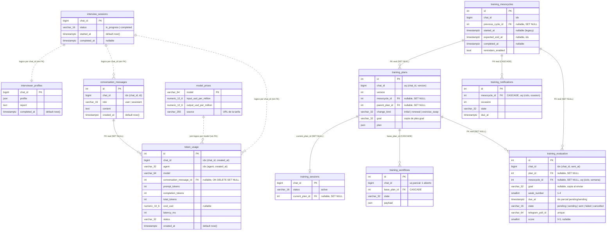

# Modelo de datos de FitCoachIA

Esquema de PostgreSQL tal y como lo generan las migraciones de Alembic. La
fuente de verdad son [`alembic/versions/`](../alembic/versions/) y
[`src/fitcoach/infrastructure/database/models.py`](../src/fitcoach/infrastructure/database/models.py);
este documento es la vista de conjunto.

## 1. Diagrama

```mermaid
erDiagram
    conversation_messages {
        int         id PK
        bigint      chat_id "idx (chat_id, id)"
        varchar_16  role "user | assistant"
        text        content
        timestamptz created_at "default now()"
    }

    interview_sessions {
        bigint      chat_id PK
        varchar_16  status "in_progress | completed"
        timestamptz started_at "default now()"
        timestamptz completed_at "nullable"
    }

    interviewer_profiles {
        bigint      chat_id PK
        json        profile
        text        report
        timestamptz completed_at "default now()"
    }

    token_usage {
        int          id PK
        bigint       chat_id "idx (chat_id, created_at)"
        varchar_32   agent "idx (agent, created_at)"
        varchar_64   model
        int          conversation_message_id FK "nullable, ON DELETE SET NULL"
        int          prompt_tokens
        int          completion_tokens
        int          total_tokens
        numeric_10_6 cost_usd "nullable"
        int          latency_ms
        varchar_32   status
        timestamptz  created_at "default now()"
    }

    model_prices {
        varchar_64   model PK
        numeric_12_6 input_usd_per_million
        numeric_12_6 output_usd_per_million
        varchar_255  source "URL de la tarifa"
    }

    training_sessions {
        bigint      chat_id PK
        varchar_16  status "active"
        int         current_plan_id FK "nullable, SET NULL"
    }

    training_mesocycles {
        int         id PK
        bigint      chat_id "idx"
        int         previous_cycle_id FK "nullable, SET NULL"
        timestamptz started_at "nullable (legacy)"
        timestamptz expected_end_at "nullable, idx"
        timestamptz completed_at "nullable"
        bool        reminders_enabled
    }

    training_plans {
        int         id PK
        bigint      chat_id "uq (chat_id, version)"
        int         version
        int         mesocycle_id FK "nullable, SET NULL"
        int         parent_plan_id FK "nullable, SET NULL"
        varchar_32  change_kind "initial | renewal | exercise_swap"
        varchar_32  goal "copia de plan.goal"
        json        plan
    }

    training_workflows {
        int         id PK
        bigint      chat_id "uq parcial: 1 abierto"
        int         base_plan_id FK "CASCADE"
        varchar_32  state
        json        payload
    }

    training_notifications {
        int         id PK
        int         mesocycle_id FK "CASCADE, uq (ciclo, ocasion)"
        int         occasion
        varchar_32  state
        timestamptz due_at
    }

    training_evaluation {
        int         id PK
        bigint      chat_id "idx (chat_id, sent_at)"
        int         plan_id FK "nullable, SET NULL"
        int         mesocycle_id FK "nullable, SET NULL, uq (ciclo, semana)"
        varchar_32  goal "nullable, copia al enviar"
        smallint    week_number "1-4"
        timestamptz due_at "idx parcial pending/sending"
        varchar_16  state "pending | sending | sent | failed | cancelled"
        varchar_64  telegram_poll_id "unique"
        smallint    score "0-5, nullable"
    }

    training_mesocycles   ||--o{ training_plans : "FK real (SET NULL)"
    training_plans        ||--o| training_sessions : "current_plan_id (SET NULL)"
    training_plans        ||--o{ training_workflows : "base_plan_id (CASCADE)"
    training_mesocycles   ||--o{ training_notifications : "FK real (CASCADE)"
    training_mesocycles   ||--o{ training_evaluation : "FK real (SET NULL)"
    training_plans        ||--o{ training_evaluation : "FK real (SET NULL)"
    conversation_messages ||--o{ token_usage : "FK real (SET NULL)"
    model_prices          ||..o{ token_usage : "join logico por model (sin FK)"
    interview_sessions    ||..|| interviewer_profiles : "logico por chat_id (sin FK)"
    interview_sessions    ||..o{ conversation_messages : "logico por chat_id (sin FK)"
    interview_sessions    ||..o{ token_usage : "logico por chat_id (sin FK)"
```

Línea continua = *foreign key* real en la base de datos.
Línea discontinua = relación lógica que solo existe en el código.

## 2. Tablas

| Tabla | PK | Cardinalidad | Migración que la crea |
|---|---|---|---|
| `conversation_messages` | `id` (serial) | N por chat (histórico) | [`c5ae33575d94`](../alembic/versions/c5ae33575d94_create_conversation_messages.py) |
| `interview_sessions` | `chat_id` | 1 por chat | [`6ca1174fc623`](../alembic/versions/6ca1174fc623_add_interview_profiles.py) |
| `interviewer_profiles` | `chat_id` | 1 por chat | [`6ca1174fc623`](../alembic/versions/6ca1174fc623_add_interview_profiles.py) |
| `token_usage` | `id` (serial) | N por chat, 1 por llamada al LLM | [`7287a3dffce8`](../alembic/versions/7287a3dffce8_create_token_usage.py) |
| `model_prices` | `model` | 1 por modelo (catálogo) | [`ab12cd34ef56`](../alembic/versions/ab12cd34ef56_create_model_prices.py) |
| `training_plans` | `id` | N versiones inmutables por chat; ciclo y plan padre | `d4f1a9b7c3e2`, ampliada por `f3a8c1d4e6b2`, `a41bc08d732e` y `c2d8e4f6a1b3` (`goal`) |
| `training_sessions` | `chat_id` | Puntero autoritativo al plan vigente | `d4f1a9b7c3e2` |
| `training_mesocycles` | `id` | N ciclos por chat, con fechas y cierre declarado | `a41bc08d732e` |
| `training_workflows` | `id` | N propuestas históricas, máximo una abierta por chat | `a41bc08d732e` |
| `training_notifications` | `id` | Eventos únicos por ciclo y ocasión | `a41bc08d732e` |
| `training_evaluation` | `id` | 4 encuestas por ciclo (una por semana); cola de envío y respuesta | `c2d8e4f6a1b3` |
| `alembic_version` | `version_num` | 1 fila | la crea Alembic, no la modela la app |

Cadena de migraciones:
`c5ae33575d94` → `6ca1174fc623` → `7287a3dffce8` → `9d4e6b7a1c2f` → `ab12cd34ef56`
→ `d4f1a9b7c3e2` → `e7b2c4d9f1a3` → `f3a8c1d4e6b2` → `a41bc08d732e` → `c2d8e4f6a1b3`
→ `d9a1b3c5e7f2` → `e5c7a9b1d3f4`.
Las tres últimas son de las encuestas: esquema, *backfill* de `training_plans.goal` desde el
JSON del plan y programación de las semanas futuras de los ciclos ya abiertos (migraciones de
datos separadas de la de esquema).
La revisión intermedia [`9d4e6b7a1c2f`](../alembic/versions/9d4e6b7a1c2f_set_null_token_usage_message_fk.py)
no crea tablas: solo recrea la FK de `token_usage` con `ON DELETE SET NULL`.

## 3. Decisiones de diseño

**`chat_id` no referencia a ninguna tabla.** No existe tabla de usuarios: es el
identificador de chat de Telegram y se usa como clave de agrupación en cuatro
tablas. El código asume que equivale al `telegram_user_id` porque hoy todos los
chats son privados 1:1; si se soportan grupos o foros, la suposición se rompe en
las cuatro a la vez (ver el docstring de `TokenUsageRecord`).

**La contabilidad conserva sus referencias opcionales.** `token_usage.conversation_message_id →
conversation_messages.id`, y es *nullable* a propósito: la llamada de reparación
de JSON del entrevistador consume tokens pero no genera un turno persistido, así
que esa fila queda sin mensaje asociado. El `ON DELETE SET NULL` permite borrar
el historial de conversación sin perder la contabilidad de consumo.

**Mesociclo, versión y borrador son distintos.** `training_plans.mesocycle_id` referencia
el ciclo; `parent_plan_id` establece el linaje de versiones y `change_kind` distingue
`initial`, `renewal` y `exercise_swap`. `training_sessions.current_plan_id` selecciona
el vigente, no la mayor versión. Un borrador vive en `training_workflows.payload` y
solo recibe versión al aceptarlo. El payload incluye revisión, perfil efectivo y trazas.
Las restricciones parciales impiden dos flujos abiertos por chat; un contador de revisión
y leases evitan resultados de generación obsoletos.

`training_mesocycles` tiene fechas UTC de inicio, cierre previsto y cierre declarado;
una sustitución no las reinicia. La migración asocia cada generación legacy a un ciclo
sin inventar fechas. `training_notifications` guarda ocasión, estado, vencimiento, intentos
y lease. Su FK al ciclo y la del flujo al plan base usan borrado en cascada;
el reset de entrevista elimina los ciclos después de eliminar planes y sesión.
La base vectorial sigue separada y de solo lectura: Alembic no modifica su catálogo.

**`training_evaluation` es cola y resultado a la vez, y sobrevive a `/interview`.** Las 4 filas
de un ciclo se insertan al darle fecha (patrón outbox): el worker solo recorre las vencidas por
el índice parcial `(due_at) WHERE state IN ('pending', 'sending')`, así que su coste depende de
las encuestas pendientes y no del número de clientes. Sus FK usan `ON DELETE SET NULL` y guarda
una copia de `goal`: tras un reset de entrevista se sigue sabiendo para qué objetivo era cada nota.
`UNIQUE (mesocycle_id, week_number)` hace idempotente la programación.

**`model_prices` se resuelve en código, no con un JOIN obligatorio.** El precio
se busca en `record_token_usage()`
([`postgres_conversation_repository.py`](../src/fitcoach/infrastructure/database/postgres_conversation_repository.py))
y el coste se calcula con `Decimal` a 6 decimales. Si el modelo no está en el
catálogo, `cost_usd` queda `NULL` en lugar de fallar: un modelo nuevo nunca
rompe la ingesta, pero los paneles de coste lo subestiman en silencio. Por eso
no hay FK `token_usage.model → model_prices.model`.

**`interview_sessions` e `interviewer_profiles` no son históricas.** Al tener
`chat_id` como PK, un `/interview` nuevo sobrescribe la sesión y el perfil
anteriores. Si en el futuro interesa conservar entrevistas pasadas, hay que
migrar a una PK propia con `chat_id` indexado.

**Índices.** Todos están orientados a las consultas reales del dashboard de
Grafana: `(chat_id, created_at)` y `(agent, created_at)` en `token_usage`
alimentan los paneles de tokens por usuario y por agente; `(chat_id, id)` en
`conversation_messages` sirve para recuperar el historial de un chat en orden.

## 4. Relación con la observabilidad

`token_usage` y `model_prices` son el canal de métricas de LLM: no pasan por
Prometheus, Grafana las consulta por SQL directo contra la base de la
aplicación. El detalle está en [observabilidad.md](observabilidad.md), sección 3.4.
