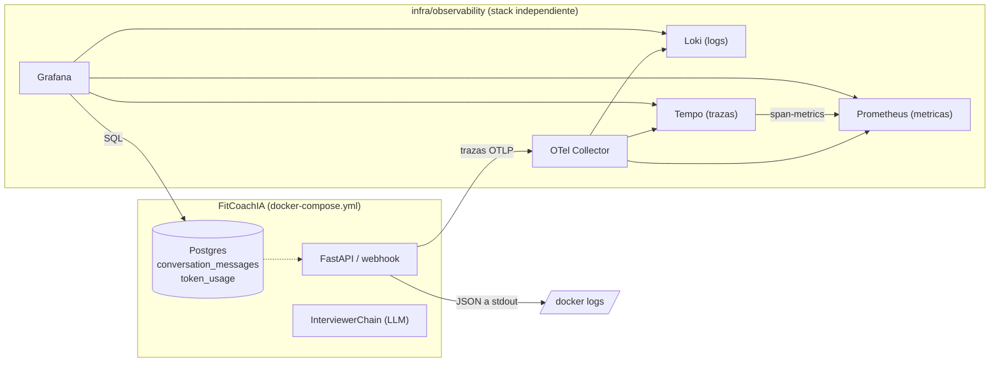

# Observabilidad de FitCoachIA

Guía de referencia del stack de observabilidad: qué componentes lo forman, qué
información recogen, cómo se visualiza en Grafana, y cómo levantarlo, pararlo
y configurarlo. Para el diseño y las decisiones que llevaron a esta
implementación, ver [plan/observabilidad.md](plan/observabilidad.md).

## 1. Visión general

El stack vive en `infra/observability/`, **desacoplado** del compose de la
aplicación (`docker-compose.yml` / `docker-compose.dev.yml`): tiene su propio
`compose.yml`, arranca y se detiene de forma independiente, y la app sigue
funcionando (sin telemetría) si el stack no está levantado.



## 2. Componentes

| Componente | Imagen | Puerto interno | Rol |
|---|---|---|---|
| **Grafana** | `grafana/grafana:11.3.0` | 3000 | Visualización: dashboards, datasources, alertas. Único servicio expuesto (vía `proxy-network` a nginx proxy manager, sin publicar el puerto al host). |
| **Prometheus** | `prom/prometheus:v3.0.1` | 9090 | Almacena métricas (scrape del propio stack + métricas de trazas generadas por Tempo). Retención 30 días. |
| **Loki** | `grafana/loki:3.3.2` | 3100 | Almacena logs. Retención 14 días. Labels de baja cardinalidad únicamente (`service_name`, `environment`, `level`); campos variables como `telegram_user_id`, `chat_id`, `agent`, `trace_id` van como *structured metadata*, no como labels. |
| **Tempo** | `grafana/tempo:2.6.1` | 3200 (+ OTLP 4317/4318) | Almacena trazas. Retención 7 días. Su `metrics_generator` produce métricas RED (`traces_spanmetrics_*`) a partir de las trazas y las envía a Prometheus por remote-write. |
| **OTel Collector** | `otel/opentelemetry-collector-contrib:0.116.1` | OTLP gRPC 4317 / HTTP 4318 | Punto único de entrada de telemetría de la app. Aplica `memory_limiter`, `batch`, `resource` (tag de entorno) y redacta cabeceras sensibles (`Authorization`, `Cookie`) antes de reenviar a Loki/Tempo/Prometheus. |

Todos los servicios están en la red interna `observability`, excepto Grafana y
el Collector, que además se unen a `proxy-network` (la misma red que usa
`fitcoach-ia` en producción) para que la app pueda enviar OTLP al Collector y
nginx proxy manager pueda llegar a Grafana por nombre de contenedor
(`fitcoach-grafana:3000`).

## 3. Qué información se recoge

### 3.1 Logs (app → stdout, JSON)

`fitcoach.infrastructure.config.logging_config.JsonFormatter` escribe cada
línea de log como un objeto JSON con:

- `timestamp`, `level`, `logger`, `message`.
- `service.name`, `service.version`, `deployment.environment.name`.
- `trace_id` / `span_id` cuando el log ocurre dentro de una traza activa
  (permite saltar de un log a su traza en Grafana).

El propio mensaje de `conversation_service.py` incluye además, como texto
estructurado en el prefijo de cada línea: `update`, `chat`, `thread`, `msg`,
`user` y **`telegram_user_id`** (el id numérico de Telegram, no solo el
username).

> Nota: hoy estos logs solo llegan a `stdout`/`docker logs`. Para que
> aparezcan en Loki falta un recolector de logs de contenedor (p. ej. Grafana
> Alloy) apuntando al Collector o a Loki directamente; no forma parte todavía
> de este stack (ver «Pendiente» más abajo).

### 3.2 Trazas (app → OTel Collector → Tempo)

`fitcoach.infrastructure.observability.telemetry.configure_telemetry` instrumenta
automáticamente FastAPI, HTTPX y SQLAlchemy, y añade un span propio
`conversation.turn` por cada mensaje de Telegram procesado
(`conversation_service.py`), con los atributos:

- `telegram_user_id`, `chat_id`, `command` (`START`, `INTERVIEW`, `DOUBTS`, `PROGRESS`, `none`).
- `agent` (valor del enum `AgentType`: `interviewer`, y en el futuro `trainer`/`nutritionist`/`coach`).
- `llm.total_tokens` y `llm.calls` cuando el LLM responde con éxito.

Todo esto solo se exporta si la variable de entorno `otel_exporter_otlp_endpoint`
está configurada en la app; si no lo está, `configure_telemetry` es un no-op
(no bloquea el arranque ni las peticiones).

### 3.3 Métricas (Tempo → Prometheus)

No hay un exportador de métricas propio en la app; las métricas provienen del
`metrics_generator` de Tempo, que deriva de las trazas recibidas:

- `traces_spanmetrics_calls_total` (volumen de llamadas por servicio/span/código de estado).
- `traces_spanmetrics_latency_bucket` (histograma de latencias, para p50/p95/p99).
- Métricas de servicio-a-servicio (`service-graph`).

### 3.4 Tokens y coste del LLM (Postgres, tabla `token_usage`)

Cada llamada al modelo (`InterviewerChain._invoke`, incluida la llamada de
reparación de JSON cuando la primera respuesta es inválida) se normaliza a un
`TokenUsage` (`prompt_tokens`, `completion_tokens`, `total_tokens`, `model`) y
se persiste como una fila en `token_usage`:

| Columna | Contenido |
|---|---|
| `chat_id` | Identificador de chat de Telegram (hoy equivale al usuario: solo hay chats privados 1:1). |
| `agent` | Valor de `AgentType` (`interviewer`, ...). |
| `model` | Modelo LLM usado en esa llamada concreta. |
| `conversation_message_id` | FK opcional al mensaje del asistente persistido; `NULL` en llamadas de reparación que no generan turno propio. |
| `prompt_tokens` / `completion_tokens` / `total_tokens` | Tokens consumidos. |
| `cost_usd` | Reservado para coste estimado; **sin calcular todavía** (falta una tabla de precios por modelo). |
| `latency_ms` | Duración de la llamada al LLM. |
| `status` | `"success"` (solo se persiste en el camino feliz por ahora). |
| `created_at` | Marca de tiempo. |

Índices: `(chat_id, created_at)` y `(agent, created_at)`, pensados para las
consultas «consumo por usuario en el tiempo» y «consumo por agente en el
tiempo» del dashboard.

## 4. Qué se puede visualizar en Grafana

Dashboard provisionado: **FitCoachIA - Conversaciones**
(`infra/observability/config/grafana/provisioning/dashboards/json/fitcoach-conversations.json`),
con las variables de plantilla `$agent` y `$telegram_user_id` (alimentadas por
consultas SQL a `token_usage`) filtrando todos los paneles:

1. **Tokens consumidos por agente** — serie temporal, `sum(total_tokens)` agrupado por hora y `agent`.
2. **Top usuarios por tokens consumidos** — tabla: `chat_id` (= telegram_user_id), `agent`, tokens totales, nº de llamadas, latencia media.
3. **Latencia media del LLM por agente** — serie temporal de `avg(latency_ms)`.
4. **Llamadas al LLM por estado** — serie temporal de recuento por `status`.
5. **Logs de conversación filtrados por usuario** — panel de logs de Loki (`{service_name="fitcoach-ia"} | json | telegram_user_id=~"$telegram_user_id"`); vacío hasta que se conecte un recolector de logs (ver más abajo).

Datasources disponibles para explorar libremente además del dashboard:
**Prometheus**, **Loki**, **Tempo** (con correlación log↔traza vía `trace_id`)
y **PostgreSQL** (para consultas SQL ad-hoc sobre `token_usage` u otras tablas).

### Alertas provisionadas

En `infra/observability/config/grafana/provisioning/alerting/rules.yml`
(carpeta «FitCoachIA» en Grafana):

- **Latencia del LLM por encima del umbral**: `avg(latency_ms)` de los últimos 15 min > 30000 ms, sostenido 10 min.
- **Tasa de fallos del LLM elevada**: más del 20% de llamadas con `status <> 'success'` en los últimos 15 min, sostenido 10 min.

## 5. Cómo levantar el stack

Requiere la red externa `proxy-network` (la misma que usa `fitcoach-ia` en
producción). Si no existe todavía:

```bash
docker network create proxy-network
```

Configurar las variables de entorno (una sola vez):

```bash
cd infra/observability
cp .env.example .env
# Editar .env: GF_ADMIN_PASSWORD, DEPLOYMENT_ENVIRONMENT,
# FITCOACH_POSTGRES_DB/USER/PASSWORD (deben coincidir con las credenciales
# reales del Postgres de la app).
```

Levantar el stack:

```bash
cd infra/observability
docker compose up -d
```

Grafana quedará accesible:
- En producción, vía nginx proxy manager en `https://grafana.fitcoach.sergiosoriano.es` (Forward Hostname/IP `fitcoach-grafana`, puerto `3000`).
- En local, si se quiere acceder directo sin NPM, añadir temporalmente `ports: ["3000:3000"]` al servicio `grafana` en `compose.yml` (no comitear ese cambio) o usar `docker compose port grafana 3000` / `docker exec` para depurar.

Usuario admin: `admin` / la contraseña definida en `GF_ADMIN_PASSWORD`.

## 6. Cómo parar el stack

```bash
cd infra/observability
docker compose down
```

Esto detiene y elimina los contenedores pero conserva los volúmenes con datos
(`fitcoach-observability-grafana`, `-prometheus`, `-loki`, `-tempo`). Para
borrar también los datos:

```bash
docker compose down -v
```

Parar (o incluso borrar) este stack **no afecta** a la app: `fitcoach-ia`
sigue respondiendo peticiones normalmente, simplemente deja de emitir trazas
(el exportador OTLP es best-effort y no bloqueante).

## 7. Cómo configurar la app para que envíe telemetría

En el entorno de la app (`.env`, `.env.dev`, `.env.prod` o variables reales del
contenedor), añadir:

```bash
otel_exporter_otlp_endpoint=http://fitcoach-otel-collector:4317
log_level=INFO           # opcional, por defecto INFO
APP_VERSION=<git-sha o version>   # opcional, aparece como service.version en logs/trazas
```

- Si `otel_exporter_otlp_endpoint` no está definida, la app arranca igual pero
  no exporta trazas (modo no-op); así es como funcionan tests, CI y el
  desarrollo local por defecto.
- El host `fitcoach-otel-collector` solo es resoluble si el contenedor de la
  app está en la misma red que el Collector (`proxy-network`); en
  `docker-compose.yml`/`docker-compose.dev.yml` ya lo está.

## 8. Cómo configurar cada componente

| Quiero cambiar... | Archivo |
|---|---|
| Retención de logs / límites de ingesta | `infra/observability/config/loki/loki.yml` |
| Retención de trazas / generación de métricas RED | `infra/observability/config/tempo/tempo.yml` |
| Scrape jobs / retención de métricas | `infra/observability/config/prometheus/prometheus.yml` |
| Receivers/processors/exporters de telemetría, redacción de datos sensibles | `infra/observability/config/otel-collector/otel-collector.yml` |
| Datasources de Grafana (Prometheus/Loki/Tempo/Postgres) | `infra/observability/config/grafana/provisioning/datasources/datasources.yml` |
| Dashboards | `infra/observability/config/grafana/provisioning/dashboards/json/*.json` |
| Alertas | `infra/observability/config/grafana/provisioning/alerting/rules.yml` |
| Contraseñas / entorno del stack | `infra/observability/.env` (no versionado; plantilla en `.env.example`) |
| Qué exporta la app (endpoint OTLP, nivel de log) | variables de entorno de la app: `otel_exporter_otlp_endpoint`, `log_level`, `APP_VERSION` |

Tras cambiar cualquier archivo de configuración de un servicio, basta con
recrearlo:

```bash
cd infra/observability
docker compose up -d --force-recreate <servicio>   # p. ej. grafana, prometheus, loki, tempo, otel-collector
```

Los cambios en dashboards/alertas/datasources se recargan solos (Grafana
revisa el directorio de provisioning cada 30s); no hace falta reiniciar
Grafana salvo que cambie el propio `compose.yml`.

## 9. Limitaciones conocidas / próximos pasos

- **`cost_usd` sin calcular**: la columna existe en `token_usage` pero
  necesita una tabla de precios por modelo que todavía no existe.
- **Logs de la app no llegan a Loki todavía**: la app emite JSON a `stdout`,
  pero falta desplegar un recolector (Grafana Alloy u otro) que lea los logs
  del contenedor y los reenvíe a Loki/el Collector. El panel de logs del
  dashboard y las `structured metadata` de Loki ya están preparados para
  cuando esto se conecte.
- **Sin agentes adicionales todavía**: `AgentType` ya contempla
  `trainer`/`nutritionist`/`coach` como valores del enum, pero solo
  `interviewer` está implementado; los paneles y alertas por `agent` ya
  funcionan sin cambios en cuanto se añadan.
