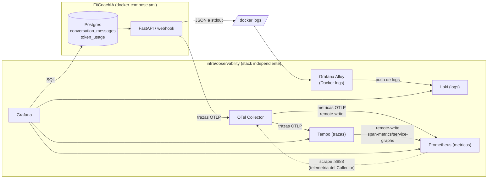

# Observabilidad de FitCoachIA

Guía de referencia del stack de observabilidad: qué componentes lo forman, qué
información recogen, cómo se visualiza en Grafana, y cómo levantarlo, pararlo
y configurarlo. Para el diseño y las decisiones que llevaron a esta
implementación, ver [plan/observabilidad.md](plan/observabilidad.md).

## 1. Visión general

El stack vive en `infra/observability/`, **desacoplado** del compose de la
aplicación (`docker-compose.yml` / `docker-compose.dev.yml`): tiene su propio
`compose.yml`, arranca y se detiene de forma independiente, y la app sigue
funcionando (sin telemetría) si el stack no está levantado.



## 2. Componentes

| Componente | Imagen | Puerto interno | Rol |
|---|---|---|---|
| **Grafana** | `grafana/grafana:11.3.0` | 3000 | Visualización: dashboards, datasources, alertas. Único servicio expuesto (vía `proxy-network` a nginx proxy manager, sin publicar el puerto al host). |
| **Prometheus** | `prom/prometheus:v3.0.1` | 9090 | Almacena métricas. Tres orígenes: scrape del propio stack, remote-write de Tempo (`traces_spanmetrics_*`) y remote-write del Collector (métricas OTLP de la app). Retención 30 días. Arranca con `--enable-feature=exemplar-storage`: sin ese flag aceptaría el write y descartaría los exemplars en silencio. |
| **Loki** | `grafana/loki:3.3.2` | 3100 | Almacena logs. Retención 14 días. Labels de baja cardinalidad únicamente (`service_name`, `environment`, `level`); campos variables como `telegram_user_id`, `chat_id`, `agent`, `trace_id` van como *structured metadata*, no como labels. |
| **Tempo** | `grafana/tempo:2.6.1` | 3200 (+ OTLP 4317/4318) | Almacena trazas. Retención 7 días. Su `metrics_generator` produce métricas RED (`traces_spanmetrics_*`) a partir de las trazas y las envía a Prometheus por remote-write. |
| **OTel Collector** | `otel/opentelemetry-collector-contrib:0.116.1` | OTLP gRPC 4317 / HTTP 4318 | Punto único de entrada de telemetría de la app. Aplica `memory_limiter`, `resource`, redacción y `batch`. Reenvía logs a Loki, trazas a Tempo y métricas a Prometheus por remote-write. Las colas de Loki y Tempo se persisten en disco; la de métricas es en memoria (ver sección 9). |
| **Grafana Alloy** | `grafana/alloy:v1.5.1` | 12345 (UI/API interno) | Lee los logs de los contenedores `fitcoach-ia`/`dev-fitcoach-ia` vía el socket de Docker (solo lectura) y los reenvía a Loki. Filtra explícitamente por nombre de contenedor: aunque el socket expone todo el host, solo se leen y reenvían los logs de la app. |

Todos los servicios están en la red interna `observability`, excepto Grafana y
el Collector, que además se unen a `proxy-network` (la misma red que usa
`fitcoach-ia` en producción) para que la app pueda enviar OTLP al Collector y
nginx proxy manager pueda llegar a Grafana por nombre de contenedor
(`fitcoach-grafana:3000`).

## 3. Qué información se recoge

### 3.1 Logs (app → stdout, JSON)

`fitcoach.infrastructure.config.logging_config.JsonFormatter` escribe cada
línea de log como un objeto JSON con:

- `timestamp`, `level`, `logger`, `message`.
- `service.name`, `service.version`, `deployment.environment.name`.
- `trace_id` / `span_id` cuando el log ocurre dentro de una traza activa
  (permite saltar de un log a su traza en Grafana).

El propio mensaje de `conversation_service.py` incluye además, como texto
estructurado en el prefijo de cada línea: `update`, `chat`, `thread`, `msg`,
`user` y **`telegram_user_id`** (el id numérico de Telegram, no solo el
username).

Grafana Alloy (`infra/observability/config/alloy/config.alloy`) lee estos logs
del contenedor de la app vía el socket de Docker y los reenvía a Loki,
etiquetados con `service_name=fitcoach-ia`, `environment` (`dev`/`prod`, según
el nombre del contenedor) y `container`. Como `telegram_user_id` va embebido en
el texto del mensaje (no es un campo JSON de nivel superior), las consultas que
necesiten filtrar por él usan una etapa `| regexp` de LogQL en lugar de `| json`
(ver el panel de logs del dashboard, más abajo).

### 3.2 Trazas (app → OTel Collector → Tempo)

`fitcoach.infrastructure.observability.telemetry.configure_telemetry` instrumenta
automáticamente FastAPI, HTTPX y SQLAlchemy, y añade un span propio
`conversation.turn` por cada mensaje de Telegram procesado
(`conversation_service.py`), con los atributos:

- `telegram_user_id`, `chat_id`, `command` (`START`, `INTERVIEW`, `DOUBTS`, `PROGRESS`, `none`).
- `agent` (valor del enum `AgentType`: `interviewer`, y en el futuro `trainer`/`nutritionist`/`coach`).
- `llm.total_tokens` y `llm.calls` cuando el LLM responde con éxito.

Todo esto solo se exporta si la variable de entorno `otel_exporter_otlp_endpoint`
está configurada en la app; si no lo está, `configure_telemetry` es un no-op
(no bloquea el arranque ni las peticiones).

### 3.3 Métricas (Tempo → Prometheus)

**La app todavía no emite métricas propias**: `telemetry.py` solo crea un
`TracerProvider`, no un `MeterProvider`. Las métricas actuales provienen del
`metrics_generator` de Tempo, que las deriva de las trazas recibidas:

- `traces_spanmetrics_calls_total` (volumen de llamadas por servicio/span/código de estado).
- `traces_spanmetrics_latency_bucket` (histograma de latencias, para p50/p95/p99).
- Métricas de servicio-a-servicio (`service-graph`).

El pipeline `metrics` del Collector ya está montado y escribe a Prometheus por
remote-write, pero de momento no recibe nada. Se activará cuando la app cree su
`MeterProvider` (ver [plan/plan-metricas-custom.md](plan/plan-metricas-custom.md)).
Ese plan también decide apagar el `span-metrics` de Tempo para no medir lo mismo
dos veces, así que esta sección cambiará cuando se ejecute.

### 3.4 Tokens y coste del LLM (Postgres, tabla `token_usage`)

Cada llamada al modelo (`InterviewerChain._invoke`, incluida la llamada de
reparación de JSON cuando la primera respuesta es inválida) se normaliza a un
`TokenUsage` (`prompt_tokens`, `completion_tokens`, `total_tokens`, `model`) y
se persiste como una fila en `token_usage`:

| Columna | Contenido |
|---|---|
| `chat_id` | Identificador de chat de Telegram (hoy equivale al usuario: solo hay chats privados 1:1). |
| `agent` | Valor de `AgentType` (`interviewer`, ...). |
| `model` | Modelo LLM usado en esa llamada concreta. |
| `conversation_message_id` | FK opcional al mensaje del asistente persistido; `NULL` en llamadas de reparación que no generan turno propio. |
| `prompt_tokens` / `completion_tokens` / `total_tokens` | Tokens consumidos. |
| `cost_usd` | Coste estimado calculado con `model_prices`; `NULL` si el modelo no tiene precio configurado. |
| `latency_ms` | Duración de la llamada al LLM. |
| `status` | `"success"` o el código estable del fallo (`llm_timeout`, `llm_rate_limited`, etc.). |
| `created_at` | Marca de tiempo. |

Índices: `(chat_id, created_at)` y `(agent, created_at)`, pensados para las
consultas «consumo por usuario en el tiempo» y «consumo por agente en el
tiempo» del dashboard.

## 4. Qué se puede visualizar en Grafana

Dashboard provisionado: **FitCoachIA - Conversaciones**
(`infra/observability/config/grafana/provisioning/dashboards/json/fitcoach-conversations.json`),
con variables de filtro dinámicas y paneles organizados en capas de complejidad creciente.

### 4.1 Variables de filtro

- **`$datasource`** — elige entre `PostgreSQL Dev` y `PostgreSQL Prod`.
- **`$agent`** — filtra por `interviewer`, `trainer`, `nutritionist`, `coach` (multiselecta).
- **`$telegram_user_id`** — filtra por usuario de Telegram (multiselecta).
- **`$log_level`** — filtra por nivel de log: `ERROR`, `WARNING`, `INFO`, `DEBUG` (multiselecta).

### 4.2 Paneles

#### Fila 1: Métricas de tokens LLM (desacopladas de logs)
1. **Tokens consumidos por agente** — serie temporal, `sum(total_tokens)` agrupado por hora y `agent`.
2. **Top usuarios por tokens consumidos** — tabla: `chat_id` (= telegram_user_id), `agent`, tokens totales, nº de llamadas, latencia media.
3. **Latencia media del LLM por agente** — serie temporal de `avg(latency_ms)`.
4. **Llamadas al LLM por estado** — serie temporal de recuento por `status`.

#### Fila 2: Estado de los logs en tiempo real (paneles Stat)
5. **Contadores de logs por nivel** — tres paneles Stat con colores code:
   - 🔴 **Errores** — fondo rojo; visible instantáneamente si hay problemas.
   - 🟠 **Warnings** — fondo naranja.
   - 🔵 **Infos** — fondo azul.

#### Fila 3: Actividad y throughput
6. **Throughput de logs (líneas/seg)** — serie temporal de `rate()` por nivel, permite ver picos de actividad y volumen relativo. Ignora las líneas no JSON de Uvicorn mediante `__error__=""`.
7. **Actividad por logger** — gráfico de barras agregado por módulo (`conversation_service.py`, `webhook.py`, etc.), útil para identificar fuentes ruidosas. También ignora las líneas no JSON de Uvicorn.

#### Fila 4: Debugging rápido (Últimos N eventos)
8. **Últimos 5 errores** — panel Logs nativo, maxLines=5, ordenado descendente (más nuevos primero).
9. **Últimos 5 warnings** — igual, para detectar problemas inminentes sin scrollear.

#### Fila 5: Stream de logs completo
10. **Stream de logs en vivo** — panel Logs nativo con 100 líneas máximo. Consulta el stream bruto para mostrar tanto logs JSON de la aplicación como access logs de Uvicorn; el parseo JSON se reserva para los paneles agregados.


Datasources disponibles para explorar libremente además del dashboard:
**Prometheus**, **Loki**, **Tempo** (con correlación log↔traza vía `trace_id`),
**PostgreSQL Dev** y **PostgreSQL Prod** (consultas SQL ad-hoc sobre
`token_usage` u otras tablas de cada base, ver sección 10).

### Alertas provisionadas

En `infra/observability/config/grafana/provisioning/alerting/rules.yml`
(carpeta «FitCoachIA» en Grafana), duplicadas por entorno para poder
distinguir un incidente en dev de uno en prod:

- **`[dev]`/`[prod]` Latencia p95 del LLM por encima del umbral**: percentil 95 de `latency_ms` de los últimos 15 min > 30000 ms, sostenido 10 min.
- **`[dev]`/`[prod]` Tasa de fallos del LLM elevada**: más del 20% de llamadas con `status <> 'success'` en los últimos 15 min, sostenido 10 min.

Las de prod usan `severity: critical` y las de dev `severity: warning`, y cada
grupo consulta su propio datasource (`fitcoach-postgres-dev` /
`fitcoach-postgres-prod`).

## 5. Cómo levantar el stack

Requiere la red externa `proxy-network` (la misma que usa `fitcoach-ia` en
producción). Si no existe todavía:

```bash
docker network create proxy-network
```

Configurar las variables de entorno (una sola vez):

```bash
cd infra/observability
cp .env.example .env
# Editar .env: GF_ADMIN_PASSWORD, DEPLOYMENT_ENVIRONMENT,
# FITCOACH_POSTGRES_DEV_*/FITCOACH_POSTGRES_PROD_* (deben coincidir con las
# credenciales reales de cada Postgres; ver seccion 8 sobre convivencia dev/prod).
```

Levantar el stack:

```bash
cd infra/observability
docker compose up -d
```

Grafana quedará accesible:
- En producción, vía nginx proxy manager en `https://grafana.fitcoach.sergiosoriano.es` (Forward Hostname/IP `fitcoach-grafana`, puerto `3000`).
- En local, si se quiere acceder directo sin NPM, añadir temporalmente `ports: ["3000:3000"]` al servicio `grafana` en `compose.yml` (no comitear ese cambio) o usar `docker compose port grafana 3000` / `docker exec` para depurar.

Usuario admin: `admin` / la contraseña definida en `GF_ADMIN_PASSWORD`.

## 6. Cómo parar el stack

```bash
cd infra/observability
docker compose down
```

Esto detiene y elimina los contenedores pero conserva los volúmenes con datos
(`fitcoach-observability-grafana`, `-prometheus`, `-loki`, `-tempo`). Para
borrar también los datos:

```bash
docker compose down -v
```

Parar (o incluso borrar) este stack **no afecta** a la app: `fitcoach-ia`
sigue respondiendo peticiones normalmente, simplemente deja de emitir trazas
(el exportador OTLP es best-effort y no bloqueante).

## 7. Cómo configurar la app para que envíe telemetría

En el entorno de la app (`.env`, `.env.dev`, `.env.prod` o variables reales del
contenedor), añadir:

```bash
otel_exporter_otlp_endpoint=http://fitcoach-otel-collector:4317
log_level=INFO           # opcional, por defecto INFO
APP_VERSION=<git-sha o version>   # opcional, aparece como service.version en logs/trazas
```

- Si `otel_exporter_otlp_endpoint` no está definida, la app arranca igual pero
  no exporta trazas (modo no-op); así es como funcionan tests, CI y el
  desarrollo local por defecto.
- El host `fitcoach-otel-collector` solo es resoluble si el contenedor de la
  app está en la misma red que el Collector (`proxy-network`); en
  `docker-compose.yml`/`docker-compose.dev.yml` ya lo está.
- Ya está activada en `.env.dev`. Para producción, añadir la misma línea a
  `.env.prod` en el servidor (no está versionado, hay que editarlo a mano).

## 8. Cómo conviven dev y producción sin pisarse

El stack de observabilidad es único y compartido, pero cada canal de
telemetría separa dev de prod de una forma distinta:

- **Trazas**: se distinguen por la etiqueta `deployment.environment.name`,
  que sale de `APP_ENV` (`dev` en `docker-compose.dev.yml`, `prod` en
  `docker-compose.yml`). Basta con activar `otel_exporter_otlp_endpoint` en
  ambos `.env.<entorno>` para que las dos lleguen a la vez al mismo Collector.
- **Logs**: Alloy ingiere `fitcoach-ia` y `dev-fitcoach-ia` simultáneamente
  (ver `config/alloy/config.alloy`) y las distingue con la label
  `environment` (`dev`/`prod`), calculada a partir del nombre del contenedor.
- **Tokens/SQL (`token_usage`)**: cada entorno tiene su propio servicio
  Postgres, **nombrado de forma distinta a propósito**
  (`postgres-dev` en `docker-compose.dev.yml`, `postgres-prod` en
  `docker-compose.yml`). Esto es importante: si ambos se llamaran `postgres`
  y los dos estuvieran conectados a `proxy-network` a la vez, Docker
  registraría el mismo alias DNS para los dos contenedores y la resolución
  sería ambigua (potencialmente, `fitcoach-ia` de producción podría acabar
  hablando con la base de datos de desarrollo). Al tener nombres de servicio
  distintos, cada app resuelve siempre su propia base de datos sin ambigüedad,
  y Grafana puede tener **dos datasources separados**
  (`PostgreSQL Dev` → `postgres-dev:5432`, `PostgreSQL Prod` →
  `postgres-prod:5432`), seleccionables en el dashboard con la variable
  `$datasource`.
- **La misma regla vale para el servicio de la app**, y no es teórica: durante
  un tiempo los dos Compose llamaron `fitcoach-ia` a su servicio, ambos
  conectados a `proxy-network`. Como Compose registra el **nombre del servicio**
  como alias de red, ese nombre resolvía a dos contenedores y el DNS los
  alternaba, así que parte del tráfico del dominio de producción aterrizaba en
  el contenedor de desarrollo: los mensajes al bot de producción los contestaba
  el bot de desarrollo, con su base de datos y su skill recortada. Hoy los
  servicios se llaman `fitcoach-ia-dev` y `fitcoach-ia-prod`.

> **Regla general**: todo servicio conectado a `proxy-network` debe tener un
> **nombre de servicio** único por entorno. El `container_name` no basta —
> desambigua el contenedor, pero el alias de red sale del nombre del servicio, y
> un `alias` declarado tampoco lo sustituye: se suma al implícito.
- **Alertas**: duplicadas por entorno (`[dev]`/`[prod]` en el título), cada
  una apuntando a su propio datasource Postgres.

Si vas a desplegar producción por primera vez en este host, solo hace falta:
1. Añadir `otel_exporter_otlp_endpoint=http://fitcoach-otel-collector:4317` a `.env.prod`.
2. Rellenar `FITCOACH_POSTGRES_PROD_DB/USER/PASSWORD` en `infra/observability/.env` con las credenciales reales de `docker-compose.yml`.
3. `docker compose -f infra/observability/compose.yml up -d --force-recreate grafana` para que recargue las credenciales.

## 9. Cómo configurar cada componente

| Quiero cambiar... | Archivo |
|---|---|
| Retención de logs / límites de ingesta | `infra/observability/config/loki/loki.yml` |
| Retención de trazas / generación de métricas RED | `infra/observability/config/tempo/tempo.yml` |
| Scrape jobs / retención de métricas | `infra/observability/config/prometheus/prometheus.yml` |
| Receivers/processors/exporters de telemetría, redacción de datos sensibles | `infra/observability/config/otel-collector/otel-collector.yml` |
| Qué contenedores se leen y qué labels se les asignan en Loki | `infra/observability/config/alloy/config.alloy` |
| Datasources de Grafana (Prometheus/Loki/Tempo/Postgres) | `infra/observability/config/grafana/provisioning/datasources/datasources.yml` |
| Dashboards | `infra/observability/config/grafana/provisioning/dashboards/json/*.json` |
| Alertas | `infra/observability/config/grafana/provisioning/alerting/rules.yml` |
| Contraseñas / entorno del stack | `infra/observability/.env` (no versionado; plantilla en `.env.example`) |
| Qué exporta la app (endpoint OTLP, nivel de log) | variables de entorno de la app: `otel_exporter_otlp_endpoint`, `log_level`, `APP_VERSION` |

El Collector persiste las colas de **Loki y Tempo** en `/var/lib/otelcol/queue`,
respaldado por el volumen `fitcoach-observability-otel-collector` (el servicio
`otel-collector-init` crea ese directorio antes de arrancar). Esos dos
exportadores reintentan durante un máximo de 5 minutos; si el backend sigue
caído o la cola se llena, el Collector descarta datos para proteger la
disponibilidad del proceso.

**Las métricas son la excepción**: el exportador `prometheusremotewrite` no
admite cola persistente —rechaza la clave `sending_queue`—, solo su propio
`remote_write_queue` en memoria. Un reinicio del Collector pierde lo que haya
encolado. El impacto es menor de lo que parece: logs y trazas son *eventos* y el
que se pierde no vuelve, mientras que las métricas OTLP son **acumulativas** y
cada exportación lleva el total desde el arranque del proceso, así que la
siguiente vuelve a declararlo y `rate()` interpola el hueco. Lo único que se
pierde de forma irrecuperable son los *exemplars* de esa exportación.

Un efecto secundario a tener presente: `remote_write_queue` tiene `queue_size:
5000` y el `memory_limiter` actúa a nivel de **todo el Collector**. Si Prometheus
estuviera caído mucho tiempo, esa cola podría presionar al limitador y degradar
también la ingesta de logs y trazas.

Tras cambiar cualquier archivo de configuración de un servicio, basta con
recrearlo:

```bash
cd infra/observability
docker compose up -d --force-recreate <servicio>   # p. ej. grafana, prometheus, loki, tempo, otel-collector
```

Los cambios en dashboards/alertas/datasources se recargan solos (Grafana
revisa el directorio de provisioning cada 30s); no hace falta reiniciar
Grafana salvo que cambie el propio `compose.yml`.

## 10. Limitaciones conocidas / próximos pasos

- **Precios del modelo**: `model_prices` contiene el precio por millón de tokens
  de entrada y salida. Los modelos sin precio configurado mantienen
  `token_usage.cost_usd` en `NULL`.
- **Sin agentes adicionales todavía**: `AgentType` ya contempla
  `trainer`/`nutritionist`/`coach` como valores del enum, pero solo
  `interviewer` está implementado; los paneles y alertas por `agent` ya
  funcionan sin cambios en cuanto se añadan.
- **Alloy necesita el socket de Docker montado en solo lectura**: es un
  privilegio amplio (puede enumerar todos los contenedores del host), acotado
  únicamente por la configuración (`discovery.relabel` descarta todo lo que no
  sea `fitcoach-ia`/`dev-fitcoach-ia` antes de leer sus logs). Revisar si el
  entorno de despliegue requiere una alternativa (p. ej. el driver de log
  `loki` de Docker a nivel de daemon).
